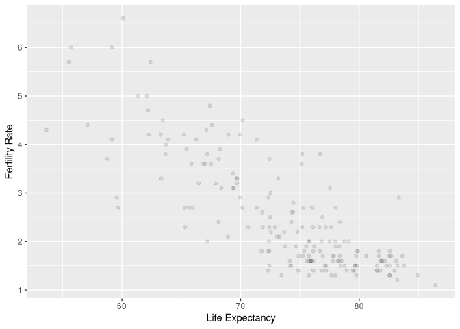
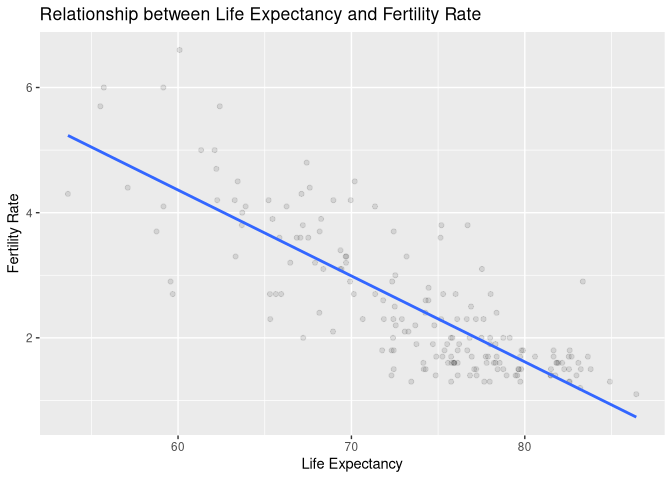
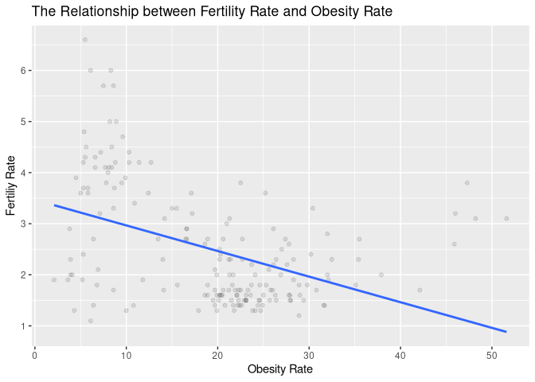
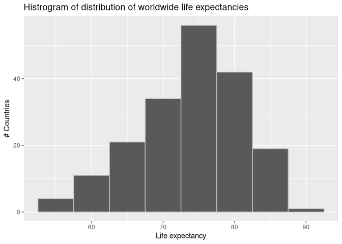
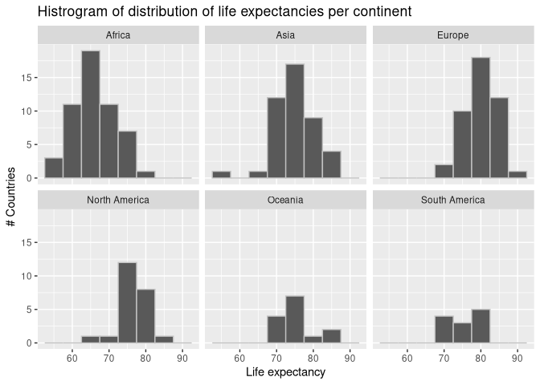
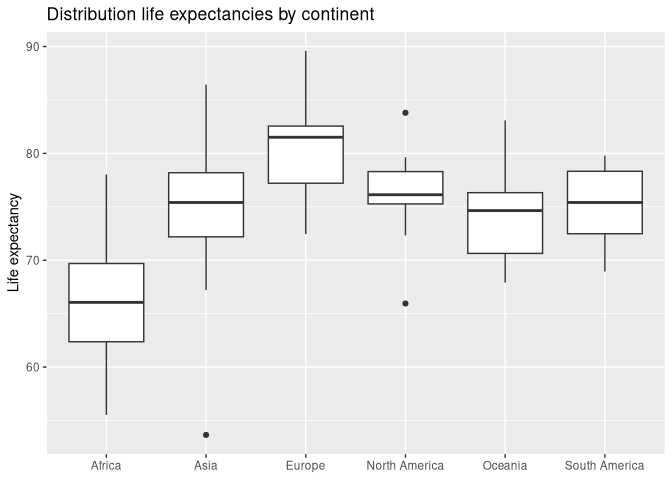
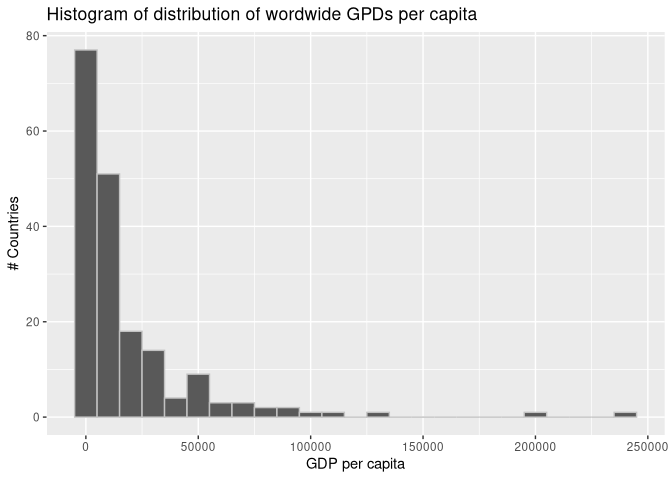
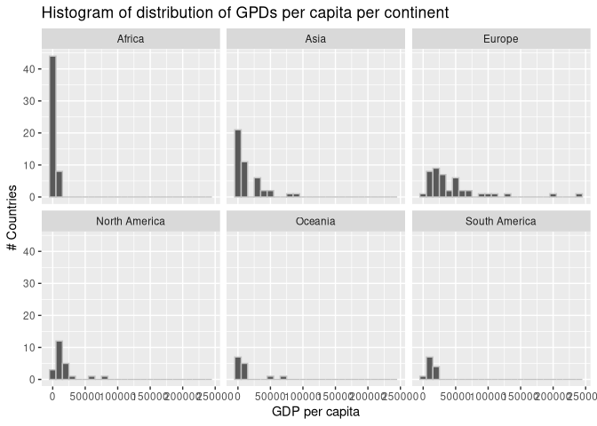
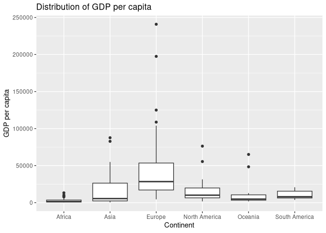

# 5 Simple Linear Regression
Max Hachemeister
2026-03-07

- [Prerequisites](#prerequisites)
  - [Link to Chapter](#link-to-chapter)
- [5.1 One numerical explanatory
  Variable](#51-one-numerical-explanatory-variable)
  - [5.1.1 Exploratory data analysis](#511-exploratory-data-analysis)
  - [5.1.2 Simple linear regression](#512-simple-linear-regression)
  - [5.1.3 Observed/fitted values and
    residuals](#513-observedfitted-values-and-residuals)
- [5.2 One categorical explanatory
  variable](#52-one-categorical-explanatory-variable)
  - [5.2.1 Exploratory data analysis](#521-exploratory-data-analysis)
  - [5.2.2 Linear regression](#522-linear-regression)
  - [5.2.3 Observed/fitted values and
    residuals](#523-observedfitted-values-and-residuals)
- [5.3 Related topics](#53-related-topics)
  - [5.3.1 Correlation it not necessarily
    causation](#531-correlation-it-not-necessarily-causation)
  - [5.3.2 Best-fitting line](#532-best-fitting-line)
  - [5.3.3](#533)

## Prerequisites

### [Link to Chapter](https://moderndive.com/v2/regression.html)

``` r
# The "setup" makes the code chunk execute before any other, when this file is accessed again.

#| label: setup
#| include: false

# packages don't get saved between sessions, so need to install them each time
## install.packages(c(
##   "tidyverse",
##   "moderndive",
##   "markdown"
##   ))

# and then open the packages
library(tidyverse)
```

    ── Attaching core tidyverse packages ──────────────────────── tidyverse 2.0.0 ──
    ✔ dplyr     1.1.4     ✔ readr     2.1.6
    ✔ forcats   1.0.1     ✔ stringr   1.6.0
    ✔ ggplot2   4.0.1     ✔ tibble    3.3.1
    ✔ lubridate 1.9.4     ✔ tidyr     1.3.2
    ✔ purrr     1.2.0     
    ── Conflicts ────────────────────────────────────────── tidyverse_conflicts() ──
    ✖ dplyr::filter() masks stats::filter()
    ✖ dplyr::lag()    masks stats::lag()
    ℹ Use the conflicted package (<http://conflicted.r-lib.org/>) to force all conflicts to become errors

``` r
library(moderndive)
library(markdown)
```

## 5.1 One numerical explanatory Variable

#### !clarity

Please explain why we also take `obesity_rate_2016` in the filtered
dataframe?

### 5.1.1 Exploratory data analysis

Get raw data and select columns of interest

``` r
UN_data_ch5 <-
  un_member_states_2024 |>
  select(
    iso,
    life_exp = life_expectancy_2022,
    fert_rate = fertility_rate_2022,
    obes_rate = obesity_rate_2016
  ) |>
  na.omit()
```

Take a random sample to get an intuition about the data.

``` r
UN_data_ch5 |>
  slice_sample(n = 5)
```

    # A tibble: 5 × 4
      iso   life_exp fert_rate obes_rate
      <chr>    <dbl>     <dbl>     <dbl>
    1 PAK       69.7       3.3       8.6
    2 SUR       72.4       2.3      26.4
    3 UZB       75.3       2.7      16.6
    4 UKR       73.4       1.3      24.1
    5 DZA       78.0       2.7      27.4

Get a statistical summary of the data.

Here we just take the two main variables, as `iso` being type character
isn’t sensibly summarized by standard numeric functions and `obes_rate`
is not of interest at the moment.

``` r
UN_data_ch5 |>
  # I'm using the numbers of the columns here, because I'm to lazy to type them out
  select(2, 3) |>
  tidy_summary()
```

    # A tibble: 2 × 11
      column        n group type      min    Q1  mean median    Q3   max    sd
      <chr>     <int> <chr> <chr>   <dbl> <dbl> <dbl>  <dbl> <dbl> <dbl> <dbl>
    1 life_exp    181 <NA>  numeric  53.6  69.4 73.6    75.1  78.3  86.4  6.80
    2 fert_rate   181 <NA>  numeric   1.1   1.6  2.50    2     3.2   6.6  1.15

``` r
## this should also work directly inside the tidy_summary() function
UN_data_ch5 |>
  tidy_summary(columns = c(2,3))
```

    # A tibble: 2 × 11
      column        n group type      min    Q1  mean median    Q3   max    sd
      <chr>     <int> <chr> <chr>   <dbl> <dbl> <dbl>  <dbl> <dbl> <dbl> <dbl>
    1 life_exp    181 <NA>  numeric  53.6  69.4 73.6    75.1  78.3  86.4  6.80
    2 fert_rate   181 <NA>  numeric   1.1   1.6  2.50    2     3.2   6.6  1.15

Get the correlation (coefficient) for the two variables.

``` r
# this can either be done via the cor() function within summarize()
UN_data_ch5 |>
  summarize(correlation = cor(fert_rate, life_exp))
```

    # A tibble: 1 × 1
      correlation
            <dbl>
    1      -0.812

``` r
# aswell as with the get_correlation() function from moderndive
UN_data_ch5 |>
  get_correlation(fert_rate ~ life_exp)
```

    # A tibble: 1 × 1
         cor
       <dbl>
    1 -0.812

Make a scatter plot for the two variables.

``` r
UN_data_ch5 |>
  ggplot(aes(life_exp, fert_rate)) +
  geom_point(alpha = .1) +
  labs(x = "Life Expectancy", y = "Fertility Rate")
```



Add a `geom_smooth()` to visually represent the correlation.

``` r
UN_data_ch5 |>
  ggplot(aes(life_exp, fert_rate)) +
  geom_point(alpha = .1) +
  # here is the line
  geom_smooth(method = "lm", se = FALSE) +
  labs(x = "Life Expectancy",
       y = "Fertility Rate",
       title = "Relationship between Life Expectancy and Fertility Rate")
```

    `geom_smooth()` using formula = 'y ~ x'



#### LC5.1

> Conduct a new exploratory data analysis with the same outcome variable
> y being `fert_rate` but with `obes_rate` as the new explanatory
> variable x:
>
> This involves three things
>
> 1.  Looking at the raw data values.
>
> 2.  Computing summary statistics.
>
> 3.  Creating data visualizations.
>
> What can you say about the relationship between obesity rate and
> fertility rate based on this exploration?

Look at the raw data values:

``` r
# check out the data
UN_data_ch5 |>
  view()

# take a random sample
UN_data_ch5 |>
  slice_sample(n = 5)
```

    # A tibble: 5 × 4
      iso   life_exp fert_rate obes_rate
      <chr>    <dbl>     <dbl>     <dbl>
    1 GAB       69.7       3.3      15  
    2 HTI       66.0       2.7      22.7
    3 SEN       70.0       4.2       8.8
    4 BFA       63.4       4.5       5.6
    5 MDG       68.2       3.7       5.3

Compute summary statistics:

``` r
# univariate statistical summary
UN_data_ch5 |>
  tidy_summary(columns = c(fert_rate, obes_rate))
```

    # A tibble: 2 × 11
      column        n group type      min    Q1  mean median    Q3   max    sd
      <chr>     <int> <chr> <chr>   <dbl> <dbl> <dbl>  <dbl> <dbl> <dbl> <dbl>
    1 fert_rate   181 <NA>  numeric   1.1   1.6  2.50    2     3.2   6.6  1.15
    2 obes_rate   181 <NA>  numeric   2.1   9.6 19.3    20.6  25.2  51.6  9.99

``` r
# bivariate statistic, correlation coefficient
## version 1
UN_data_ch5 |>
  summarize(correlation_coefficient = cor(fert_rate, obes_rate))
```

    # A tibble: 1 × 1
      correlation_coefficient
                        <dbl>
    1                  -0.435

``` r
## version 2
UN_data_ch5 |>
  get_correlation(formula = fert_rate ~ obes_rate)
```

    # A tibble: 1 × 1
         cor
       <dbl>
    1 -0.435

The middle 50% of the countries have a fertility rate between 1.6 and
3.2 and an obesity rate between 9.6 and 20.6. The median fertility rate
is 2.0, while that of the obesity rate is 20.6.

The fertility rate seems to correlate slightly negative with obesity
rate.

Visualize the data:

``` r
# make a scatterplot and fit a linear regression line
UN_data_ch5 |>
  ggplot(aes(x = obes_rate, y = fert_rate)) +
  geom_point(alpha = .1) +
  geom_smooth(method = "lm",
              formula = "y ~ x",
              se = FALSE) +
  labs(x = "Obesity Rate",
       y = "Fertiliy Rate",
       title = "The Relationship between Fertility Rate and Obesity Rate"
  )
```



Fertility Rate and Obesity Rate show a rather random distribution, with
a main cluster around a fertility rate of 1.5 and a obesity rate of 25,
while for fertility rates between 2 to 4 the obesity rate seems most
random.

#### LC5.2

> What is the main purpose of performing an exploratory data analysis
> (EDA) before fitting a regression model?

- A. To predict future values.

- *B. To understand the relationship between variables and detect
  potential issues.*

- C. To create more variables.

- D. To generate random samples.

LC5.3

> Which of the following is correct about the correlation coefficient?

- A. It ranges from -2 to 2.

- B. It only measures the strength of non-linear relationships.

- *C. It ranges from -1 to 1 and measures the strength of linear
  relationships.*

- D. It is always zero.

### 5.1.2 Simple linear regression

Fit a model and get the regression coefficient:

``` r
# fit the model and save it to an object
demographics_model <-
  lm(fert_rate ~ life_exp, data = UN_data_ch5)

# get the coefficient
coef(demographics_model)
```

    (Intercept)    life_exp 
     12.5992926  -0.1372879 

#### LC5.4

> Fit a simple linear regression using
> `lm(fert_rate ~ obes_rate, data = UN_data_ch5)` where `obes_rate` is
> the new explanatory variable $x$. Learn about the “best-fitting” line
> from the regression coefficients by applying the
> [`coef()`](https://rdrr.io/r/stats/coef.html) function. How do the
> regression results match up with your earlier exploratory data
> analysis?

Fit a linear model and get the regression coefficients:

``` r
# fit the linear model
lm_fert_obes <-
  lm(fert_rate ~ obes_rate, data = UN_data_ch5)

# get the coefficient
coef(lm_fert_obes)
```

    (Intercept)   obes_rate 
     3.46741945 -0.05012407 

The regression coefficient and the correlation coefficient are both
negative, and also only represent a weak relationship between fertility
rate and obesity rate.

#### LC5.5

> What does the intercept term $b_0$ represent in simple linear
> regression?

- A. The change in the outcome for a one-unit change in the explanatory
  variable.

- *B. The predicted value of the outcome when the explanatory variable
  is zero.*

- C. The standard error of the regression.

- D. The correlation between the outcome and explanatory variables.

#### LC5.6

> What best describes the “slope” of a simple linear regression line?

- A. The increase in the explanatory variable for a one-unit increase in
  the outcome.

- B. The average of the explanatory variable.

- *C. The change in the outcome for a one-unit increase in the
  explanatory variable*.

- D. The minimum value of the outcome variable.

#### LC5.7

> What does a negative slope in a simple linear regression indicate?

- *A. The outcome variable decreases as the explanatory variable
  increases.*

- B. The explanatory variable remains constant as the outcome variable
  increases.

- C. The correlation coefficient is zero.

- D. The outcome variable increases as the explanatory variable
  increases.

### 5.1.3 Observed/fitted values and residuals

#### !typo

In the mathematical notation “life_exp” has an extra “\\”

This should be the solution $\text{life}\_\text{exp}$

Also “\* arrow: \[…\]” seems not formatted

#### !clarity

The Value in the table is not the same as in the text. Probably due to
default rounding. I’d prefer both to be the same

Get the fitted values and the residuals for all observations:

``` r
get_regression_points(demographics_model)
```

    # A tibble: 181 × 5
          ID fert_rate life_exp fert_rate_hat residual
       <int>     <dbl>    <dbl>         <dbl>    <dbl>
     1     1       4.3     53.6          5.23   -0.934
     2     2       1.4     79.5          1.69   -0.289
     3     3       2.7     78.0          1.89    0.813
     4     4       5       62.1          4.07    0.928
     5     5       1.6     77.8          1.92   -0.318
     6     6       1.9     78.3          1.85    0.052
     7     7       1.6     76.1          2.15   -0.548
     8     8       1.6     83.1          1.19    0.408
     9     9       1.5     82.3          1.30    0.195
    10    10       1.6     74.2          2.42   -0.819
    # ℹ 171 more rows

#### LC5.8

> What is a “wrapper function” in the context of statistical modeling in
> R?

- A. A function that directly fits a regression model without using any
  other functions.

- *B. A function that combines other functions to simplify complex
  operations and provide a user-friendly interface.*

- C. A function that removes missing values from a dataset before
  analysis.

- D. A function that only handles categorical data in regression models.

#### LC5.9

> Generate a data frame of the residuals of the *Learning check* model
> where you used `obes_rate` as the explanatory x variable.

Generate data frame with regression points for `lm_fert_obes` model:

``` r
get_regression_points(lm_fert_obes)
```

    # A tibble: 181 × 5
          ID fert_rate obes_rate fert_rate_hat residual
       <int>     <dbl>     <dbl>         <dbl>    <dbl>
     1     1       4.3       5.5          3.19    1.11 
     2     2       1.4      21.7          2.38   -0.98 
     3     3       2.7      27.4          2.09    0.606
     4     4       5         8.2          3.06    1.94 
     5     5       1.6      18.9          2.52   -0.92 
     6     6       1.9      28.3          2.05   -0.149
     7     7       1.6      20.2          2.46   -0.855
     8     8       1.6      29            2.01   -0.414
     9     9       1.5      20.1          2.46   -0.96 
    10    10       1.6      19.9          2.47   -0.87 
    # ℹ 171 more rows

LC5.10

> Which of the following statements is true about the regression line in
> a simple linear regression model?

- A. The regression line represents the average of the outcome variable.

- *B. The regression line minimizes the sum of squared differences
  between the observed and predicted values.*

- C. The regression line always has a slope of zero.

- D. The regression line is only useful when there is no correlation
  between variables.

## 5.2 One categorical explanatory variable

#### !clarity

I’m having a hard time understanding this sentence:

> We use this data for basic regression again, but now using an
> explanatory variable x
>
> that is categorical, as opposed to the numerical explanatory variable
> model we used in the previous Section
> [5.1](https://moderndive.com/v2/regression.html#model1):
>
> 1.  A numerical outcome variable y (a country’s life expectancy) and
>
> 2.  A single categorical explanatory variable x (the continent that
>     the country is a part of).

### 5.2.1 Exploratory data analysis

Create a data frame with columns of interest and without incomplete
observations:

``` r
gapminder2022 <-
  un_member_states_2024 |>
  select(country,
         life_exp = life_expectancy_2022,
         continent,
         gdp_per_capita) |>
  na.omit()
```

Get a first overview of the data:

``` r
glimpse(gapminder2022)
```

    Rows: 188
    Columns: 4
    $ country        <chr> "Afghanistan", "Albania", "Algeria", "Andorra", "Angola…
    $ life_exp       <dbl> 53.65, 79.47, 78.03, 83.42, 62.11, 77.80, 78.31, 76.13,…
    $ continent      <fct> Asia, Europe, Africa, Europe, Africa, North America, So…
    $ gdp_per_capita <dbl> 355.7778, 6810.1140, 4342.6380, 41992.7728, 3000.4442, …

``` r
gapminder2022 |>
  slice_sample(n = 5)
```

    # A tibble: 5 × 4
      country            life_exp continent     gdp_per_capita
      <chr>                 <dbl> <fct>                  <dbl>
    1 Dominican Republic     72.6 North America         10111.
    2 Guinea                 63.9 Africa                 1515.
    3 Belize                 75.8 North America          6984.
    4 Gambia, The            67.6 Africa                  808.
    5 St. Lucia              79.0 North America         13031.

#### !clarity

here another function for slicing samples is used `sample_n()`, which
has bee superseded by `slice_sample()`

Get some univariate summary statistics:

``` r
gapminder2022 |>
  tidy_summary(columns = c(life_exp, continent))
```

    # A tibble: 7 × 11
      column        n group         type    min    Q1  mean median    Q3   max    sd
      <chr>     <int> <chr>         <chr> <dbl> <dbl> <dbl>  <dbl> <dbl> <dbl> <dbl>
    1 life_exp    188 <NA>          nume…  53.6  69.4  73.8   75.2  78.4  89.6  6.93
    2 continent    52 Africa        fact…  NA    NA    NA     NA    NA    NA   NA   
    3 continent    44 Asia          fact…  NA    NA    NA     NA    NA    NA   NA   
    4 continent    43 Europe        fact…  NA    NA    NA     NA    NA    NA   NA   
    5 continent    23 North America fact…  NA    NA    NA     NA    NA    NA   NA   
    6 continent    14 Oceania       fact…  NA    NA    NA     NA    NA    NA   NA   
    7 continent    12 South America fact…  NA    NA    NA     NA    NA    NA   NA   

#### !clarity

the values for median don’t match. In the text it’s 75.14, in the table
it’s 75.2 and according to my code it’s 75.18.

Same for the mean.

Visualize the the distribution of `life_exp`:

``` r
gapminder2022 |>
  ggplot(aes(life_exp)) +
  geom_histogram(binwidth = 5, color = "grey76") +
  labs(title = "Histrogram of distribution of worldwide life expectancies",
       x = "Life expectancy",
       y = "# Countries")
```



Show Histogram for each continent.

``` r
gapminder2022 |>
  ggplot(aes(life_exp)) +
  geom_histogram(binwidth = 5, color = "grey76") +
  # change title accordingly
  labs(title = "Histrogram of distribution of life expectancies per continent",
       x = "Life expectancy",
       y = "# Countries") +
  # make a Histogram for each continent
  facet_wrap(~ continent, nrow = 2)
```



Make a side-by-side boxplot per continent:

``` r
gapminder2022 |>
  ggplot(aes(continent, life_exp)) +
  geom_boxplot() +
  labs(title = "Distribution life expectancies by continent",
       # I think the x-axis label would be redundant, as I've mentioned
       # it in the title
       x = NULL,
       y = "Life expectancy")
```



Now get the mean and median life expectancy for each per continent:

``` r
life_exp_by_continent <-
gapminder2022 |>
  group_by(continent) |>
  summarize(median = round(median(life_exp), 1),
            mean = round(mean(life_exp), 1))

life_exp_by_continent
```

    # A tibble: 6 × 3
      continent     median  mean
      <fct>          <dbl> <dbl>
    1 Africa          66.1  66.3
    2 Asia            75.4  74.9
    3 Europe          81.5  79.9
    4 North America   76.1  76.3
    5 Oceania         74.6  74.4
    6 South America   75.4  75.2

#### !clarity

there seems to be a rounding error for the mean of Asia, as it sais 50.0
in the table of the book and 74.9 in my code.

Also the rounding function is not given in the code of the book.

Get the difference of mean life expectancy for each continent to the
lowest mean life expectancy:

``` r
life_exp_by_continent |>
  select(continent,
         mean) |>
  mutate("Difference versus Africa" = mean - min(mean))
```

    # A tibble: 6 × 3
      continent      mean `Difference versus Africa`
      <fct>         <dbl>                      <dbl>
    1 Africa         66.3                       0   
    2 Asia           74.9                       8.60
    3 Europe         79.9                      13.6 
    4 North America  76.3                      10   
    5 Oceania        74.4                       8.10
    6 South America  75.2                       8.90

#### LC5.11

> Conduct a new exploratory data analysis with the same explanatory
> variable x being `continent` but with `gdp_per_capita` as the new
> outcome variable y
>
> What can you say about the differences in GDP per capita between
> continents based on this exploration?

Steps of EDA:

- select data/columns of interest

<!-- -->

- look at the raw data

- get univariate statistics / five-point summary

  - get bivariate statistics / correlation coefficient

- visualize distributions

Select data/columns of interest and look at the raw data:

``` r
gdp_worldwide <-
gapminder2022 |>
  select(-life_exp)

gdp_worldwide |>
  glimpse()
```

    Rows: 188
    Columns: 3
    $ country        <chr> "Afghanistan", "Albania", "Algeria", "Andorra", "Angola…
    $ continent      <fct> Asia, Europe, Africa, Europe, Africa, North America, So…
    $ gdp_per_capita <dbl> 355.7778, 6810.1140, 4342.6380, 41992.7728, 3000.4442, …

``` r
gdp_worldwide |>
  slice_sample(n = 5)
```

    # A tibble: 5 × 3
      country     continent gdp_per_capita
      <chr>       <fct>              <dbl>
    1 Latvia      Europe            21780.
    2 Comoros     Africa             1485.
    3 Mauritania  Africa             2065.
    4 South Sudan Africa             1072.
    5 Burundi     Africa              259.

Get univariate statistics:

``` r
gdp_worldwide |>
  tidy_summary(columns = c(gdp_per_capita, continent))
```

    # A tibble: 7 × 11
      column           n group type    min    Q1   mean median     Q3     max     sd
      <chr>        <int> <chr> <chr> <dbl> <dbl>  <dbl>  <dbl>  <dbl>   <dbl>  <dbl>
    1 gdp_per_cap…   188 <NA>  nume…  259. 2255. 18473.  6741. 20395. 240862. 30858.
    2 continent       52 Afri… fact…   NA    NA     NA     NA     NA      NA     NA 
    3 continent       44 Asia  fact…   NA    NA     NA     NA     NA      NA     NA 
    4 continent       43 Euro… fact…   NA    NA     NA     NA     NA      NA     NA 
    5 continent       23 Nort… fact…   NA    NA     NA     NA     NA      NA     NA 
    6 continent       14 Ocea… fact…   NA    NA     NA     NA     NA      NA     NA 
    7 continent       12 Sout… fact…   NA    NA     NA     NA     NA      NA     NA 

The global median GDP per capita is around 6741.3, while the mean with
circa 18472.8 lies rather upward, indicating a skew in that direction.
The relatively high standard deviation implies a high variation, which
the high range of the minimum and maximum of 259 and 240862 respectively
reflect.

Visualize Distributions

Make a Histogram

``` r
gdp_worldwide |>
ggplot(aes(gdp_per_capita)) +
  geom_histogram(binwidth = 1e4, color = "grey76") +
  labs(title = "Histogram of distribution of wordwide GPDs per capita",
       x = "GDP per capita",
       y = "# Countries")
```



With the distribution being very wide, the countries with GDP per capita
below the median are not well represented in this histogram.

Make a histogram for each continent:

``` r
gdp_worldwide |>
ggplot(aes(gdp_per_capita)) +
  geom_histogram(binwidth = 1e4, color = "grey76") +
  labs(title = "Histogram of distribution of GPDs per capita per continent",
       x = "GDP per capita",
       y = "# Countries") +
  facet_wrap(~continent)
```



The distribution of the lower GDP per capita is still unclear due to the
outliers in Europe.

Make a side-by-side barplot:

``` r
gdp_worldwide |>
  ggplot(aes(continent, gdp_per_capita)) +
  geom_boxplot() +
  labs(title = "Distribution of GDP per capita",
       x = "Continent",
       y = "GDP per capita")
```



Okay, with such a wide distribution it’s hard to get the different
groups into perspective. Europe and Asia seem have the most variation of
GDP per capita, while Africa appears to have the least in relation.

Let’s also compute the mean for each continent an add the column with
the relative difference to the lowest mean.

``` r
gdp_worldwide_diff_mean <-
  gdp_worldwide |>
    group_by(continent) |>
    summarize(median = median(gdp_per_capita),
              mean = mean(gdp_per_capita)) |>
    mutate("Difference of mean to minimal mean" = mean - min(mean))

gdp_worldwide_diff_mean
```

    # A tibble: 6 × 4
      continent     median   mean `Difference of mean to minimal mean`
      <fct>          <dbl>  <dbl>                                <dbl>
    1 Africa         1500.  2637.                                   0 
    2 Asia           5491. 15651.                               13014.
    3 Europe        28439. 45698.                               43061.
    4 North America 10111. 16351.                               13713.
    5 Oceania        4824. 12668.                               10031.
    6 South America  8022. 10721.                                8084.

#### LC5.12

> When using a categorical explanatory variable in regression, what does
> the baseline group represent?

- A. The group with the highest mean

- *B. The group chosen for comparison with all other groups*

- C. The group with the most data points

- D. The group with the lowest standard deviation

#### !clarity

I’m confused about “variable in regression”, when so far we’ve just been
computing singular datapoints and not yet a linear regression. Is
computing the difference of each mean to the lowest mean already part of
linear regression?

### 5.2.2 Linear regression

Fit a linear regression model and get the coefficients

``` r
lm_life_continent <-
  lm(life_exp ~ continent, data = gapminder2022)

coef(lm_life_continent)
```

               (Intercept)          continentAsia        continentEurope 
                 66.309808               8.639965              13.597867 
    continentNorth America       continentOceania continentSouth America 
                  9.985410               8.106621               8.917692 

#### !clarity

> See [Chapter 15](https://r4ds.had.co.nz/factors.html) of *R for Data
> Science* ([Grolemund and Wickham
> 2017](https://moderndive.com/v2/references.html#ref-rds2016)) for
> examples.

This is a reference to the deprecated first edition of that Book. Would
it be sensible to update that to chapter 16 of the second edition?

#### !typo

> In a statistical modeling context, this is also known as a *dummy
> variable*. In our case, we consider the first such indicator variable
> 1Amer(x). This indicator function returns 1 if a country is in the
> Asia, 0 otherwise:

Amer does not refer to Asia. This is also like that in the corresponding
mathjax expression.

#### LC5.13

> Fit a linear regression using
> `lm(gdp_per_capita ~ continent, data = gapminder2022)` where
> `gdp_per_capita` is the new outcome variable. Get information about
> the “best-fitting” line from the regression coefficients. How do the
> regression results match up with the results from your previous
> exploratory data analysis?

Fit a linear regression:

``` r
lm_gdp_continent <-
  lm(gdp_per_capita ~ continent, data = gapminder2022)

coef(lm_gdp_continent)
```

               (Intercept)          continentAsia        continentEurope 
                  2637.100              13014.284              43061.350 
    continentNorth America       continentOceania continentSouth America 
                 13713.476              10031.048               8083.508 

This model represents the data as we’ve computed in LC5.11.

The Intercept is the mean GDP per capita of all african countries and
hence all other coefficients are the difference in mean GDP per capita
to that for each other continent, which can also be seen in
`gdp_worldwide_diff_mean`.

``` r
gdp_worldwide_diff_mean
```

    # A tibble: 6 × 4
      continent     median   mean `Difference of mean to minimal mean`
      <fct>          <dbl>  <dbl>                                <dbl>
    1 Africa         1500.  2637.                                   0 
    2 Asia           5491. 15651.                               13014.
    3 Europe        28439. 45698.                               43061.
    4 North America 10111. 16351.                               13713.
    5 Oceania        4824. 12668.                               10031.
    6 South America  8022. 10721.                                8084.

#### LC5.14

> How many “offsets” or differences from the baseline will a regression
> model output for a categorical variable with 4 levels?

- A. 1

- B. 2

- *C. 3*

- D. 4

### 5.2.3 Observed/fitted values and residuals

Get the regression points from `lm_life_continent`:

``` r
get_regression_points(lm_life_continent,
                      ID = "country")
```

    # A tibble: 188 × 5
       country             life_exp continent     life_exp_hat residual
       <chr>                  <dbl> <fct>                <dbl>    <dbl>
     1 Afghanistan             53.6 Asia                  75.0  -21.3  
     2 Albania                 79.5 Europe                79.9   -0.438
     3 Algeria                 78.0 Africa                66.3   11.7  
     4 Andorra                 83.4 Europe                79.9    3.51 
     5 Angola                  62.1 Africa                66.3   -4.2  
     6 Antigua and Barbuda     77.8 North America         76.3    1.50 
     7 Argentina               78.3 South America         75.2    3.08 
     8 Armenia                 76.1 Asia                  75.0    1.18 
     9 Australia               83.1 Oceania               74.4    8.67 
    10 Austria                 82.3 Europe                79.9    2.36 
    # ℹ 178 more rows

``` r
# what happens without ID = "country" ?
get_regression_points(lm_life_continent)
```

    # A tibble: 188 × 5
          ID life_exp continent     life_exp_hat residual
       <int>    <dbl> <fct>                <dbl>    <dbl>
     1     1     53.6 Asia                  75.0  -21.3  
     2     2     79.5 Europe                79.9   -0.438
     3     3     78.0 Africa                66.3   11.7  
     4     4     83.4 Europe                79.9    3.51 
     5     5     62.1 Africa                66.3   -4.2  
     6     6     77.8 North America         76.3    1.50 
     7     7     78.3 South America         75.2    3.08 
     8     8     76.1 Asia                  75.0    1.18 
     9     9     83.1 Oceania               74.4    8.67 
    10    10     82.3 Europe                79.9    2.36 
    # ℹ 178 more rows

Ah okay, because the model refers to a data frame, the `ID` argument can
access other columns than those the model was fit with, so you can get
the corresponding values from these, like `country` in this case.

#### !clarity

also here getting slightly other values and `Antigua and Barbaidos`
seems a new value.

#### LC5.15

> Which interpretation is correct for a positive coefficient in a
> regression model with a categorical explanatory variable?

- A. It indicates the baseline group.

- B. It represents the mean value of the baseline group.

- *C. The corresponding group has a higher response mean than the
  baseline’s.*

- D. The corresponding group has a lower response mean than the
  baseline’s.

#### LC5.16

> Which of the following statements about residuals in regression is
> true?

- *A. Residuals are the differences between the fitted and observed
  response values.*

- B. Residuals are always positive.

- C. Residuals are not important for model evaluation.

- D. Residuals are the predicted values in the model.

#### LC5.17

> Using either the sorting functionality of RStudio’s spreadsheet viewer
> or using the data wrangling tools you learned in Chapter
> [3](https://moderndive.com/v2/wrangling.html#wrangling), identify the
> five countries with the five smallest (most negative) residuals? What
> do these negative residuals say about their life expectancy relative
> to their continents’ life expectancy?

Identify the countries with the five smallest (most negative) residuals:

``` r
get_regression_points(lm_life_continent,
                      ID = "country") |>
  slice_min(residual, n = 5)
```

    # A tibble: 5 × 5
      country                  life_exp continent     life_exp_hat residual
      <chr>                       <dbl> <fct>                <dbl>    <dbl>
    1 Afghanistan                  53.6 Asia                  75.0   -21.3 
    2 Central African Republic     55.5 Africa                66.3   -10.8 
    3 Somalia                      55.7 Africa                66.3   -10.6 
    4 Haiti                        66.0 North America         76.3   -10.3 
    5 Mozambique                   57.1 Africa                66.3    -9.21

The negative residuals of these countries represents how much their life
expectancy differs to the average of the other countries of the same
continent.

#### LC5.18

> Repeat this process, but identify the five countries with the five
> largest (most positive) residuals. What do these positive residuals
> say about their life expectancy relative to their continents’ life
> expectancy?

Get the countries with the highest residuals in life expectancy:

``` r
lm_life_continent |>
  get_regression_points(ID = "country") |>
  slice_max(residual, n = 5)
```

    # A tibble: 5 × 5
      country   life_exp continent life_exp_hat residual
      <chr>        <dbl> <fct>            <dbl>    <dbl>
    1 Algeria       78.0 Africa            66.3    11.7 
    2 Singapore     86.4 Asia              75.0    11.5 
    3 Libya         77.2 Africa            66.3    10.9 
    4 Tunisia       76.8 Africa            66.3    10.5 
    5 Japan         84.9 Asia              75.0     9.96

Positive residuals in this case represent that these countries have a
higher life expectancy than the average of the other countries of the
same continent.

## 5.3 Related topics

“associated” is a good term, to express a corellation instead of
implying a causation

### 5.3.1 Correlation it not necessarily causation

#### !clarity

Isn’t the HDI more a parameter or principal component than a measurable
variable? And it also contains the life expectancy as an input variable.
I don’t think that’s the definition of a confounding variable.

### 5.3.2 Best-fitting line

Compute the sum of least squares for the regression model of fertility
rate explained by life expectancy1:

``` r
demographics_model |>
  get_regression_points() |>
  mutate(residual_squared = residual^2) |>
  summarize(sum_squared_residuals = sum(residual_squared))
```

    # A tibble: 1 × 1
      sum_squared_residuals
                      <dbl>
    1                  81.3

#### LC5.19

> Note in Figure
> [5.12](https://moderndive.com/v2/regression.html#fig:three-lines)
> there are 3 points marked with dots and:
>
> - The “best” fitting solid regression line in blue
>
> - An arbitrarily chosen dotted red line
>
> - Another arbitrarily chosen dashed green line
>
> FIGURE 5.12: Regression line and two others.
>
> Compute the sum of squared residuals by hand for each line. Show that
> the regression line in blue has the smallest value of these three
> lines.

``` r
# create tibble with values
line_points <-
  tribble(
    ~line, ~point, ~residual,
    "red", 1, -.5,
    "red", 2, -1.5,
    "red", 3, .5,
    "green", 1, 0,
    "green", 2, -.5,
    "green", 3, 2,
    "blue", 1, .5,
    "blue", 2, -1,
    "blue", 3, .5
  )

# calculate sum of squared residuals
line_points |>
  group_by(line) |>
  summarize(sum_squared_residuals = sum(residual^2))
```

    # A tibble: 3 × 2
      line  sum_squared_residuals
      <chr>                 <dbl>
    1 blue                   1.5 
    2 green                  4.25
    3 red                    2.75

Blue has the smallest sum of squared residuals with a value of $1.5$

### 5.3.3

Check out the `augment()` and `clean_names()` function.

``` r
library(broom)
library(janitor)
```


    Attaching package: 'janitor'

    The following objects are masked from 'package:stats':

        chisq.test, fisher.test

``` r
demographics_model |>
  # augment adds the model calculations to the corresponding dataframe
  augment() |>
  # mutate_if rounds the values of all numeric columns to two digits
  mutate_if(is.numeric, round, digits = 2) |>
  # clean names takes away the prefix signs and converts to snake case
  clean_names()
```

    # A tibble: 181 × 8
       fert_rate life_exp fitted resid   hat sigma cooksd std_resid
           <dbl>    <dbl>  <dbl> <dbl> <dbl> <dbl>  <dbl>     <dbl>
     1       4.3     53.6   5.23 -0.93  0.05  0.67   0.06     -1.42
     2       1.4     79.5   1.69 -0.29  0.01  0.68   0        -0.43
     3       2.7     78.0   1.89  0.81  0.01  0.67   0.01      1.21
     4       5       62.1   4.07  0.93  0.02  0.67   0.02      1.39
     5       1.6     77.8   1.92 -0.32  0.01  0.68   0        -0.47
     6       1.9     78.3   1.85  0.05  0.01  0.68   0         0.08
     7       1.6     76.1   2.15 -0.55  0.01  0.67   0        -0.82
     8       1.6     83.1   1.19  0.41  0.02  0.67   0         0.61
     9       1.5     82.3   1.3   0.2   0.01  0.68   0         0.29
    10       1.6     74.2   2.42 -0.82  0.01  0.67   0        -1.22
    # ℹ 171 more rows
