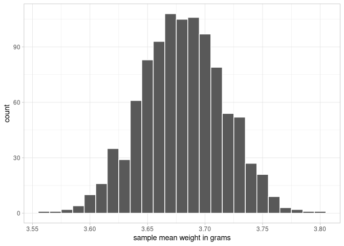
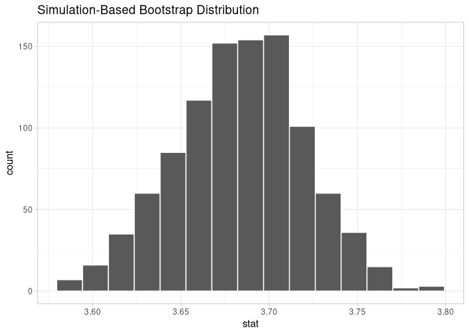
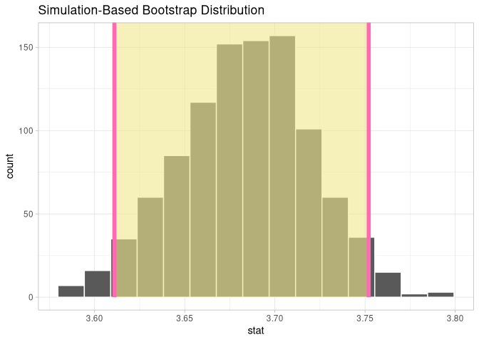

# Estimation, Confidence Intervals, and Bootstrapping
Max Hachemeister
2026-03-03

- [Prerequisites](#prerequisites)
  - [Tying the Sampling Distribution to
    Estimation](#tying-the-sampling-distribution-to-estimation)
  - [PU LC8.14](#pu-lc814)

# Prerequisites

``` r
library(tidyverse)
```

    ── Attaching core tidyverse packages ──────────────────────── tidyverse 2.0.0 ──
    ✔ dplyr     1.1.4     ✔ readr     2.1.6
    ✔ forcats   1.0.1     ✔ stringr   1.6.0
    ✔ ggplot2   4.0.1     ✔ tibble    3.3.1
    ✔ lubridate 1.9.4     ✔ tidyr     1.3.2
    ✔ purrr     1.2.0     
    ── Conflicts ────────────────────────────────────────── tidyverse_conflicts() ──
    ✖ dplyr::filter() masks stats::filter()
    ✖ dplyr::lag()    masks stats::lag()
    ℹ Use the conflicted package (<http://conflicted.r-lib.org/>) to force all conflicts to become errors

``` r
library(moderndive)
library(infer)
theme_set(theme_light())
```

## Tying the Sampling Distribution to Estimation

#### LC8.1

> What is the expected value of the sample mean weight of almonds in a
> large sample according to the sampling distribution theory?

- A. It is always larger than the population mean.
- B. It is always smaller than the population mean.
- C. It is exactly equal to the population mean.
- *D. It is equal to the population mean on average but may vary* *in a
  single sample.*

#### LC8.2

> What is a *point estimate* and how does it doffer from an *interval*
> *estimate* in the context of statistical estimation?

- A. A point estimate uses multiple values to estimate a parameter; an
  interval estimate uses a single value.

- *B. A point estimate is a single value used to estimate a parameter;*
  *an interval estimate provides a range of values within which the*
  *parameter likely fails.*

- C. A point estimate is the mean of multiple samples; an interval
  estimate is the median.

- D. A point estimate and an interval estimate are the same and can be
  used interchangeably.

##### !error

8.1.2 within 2 standard deviations *form* the mean is 95.45%

#### LC8.3

> What does the population mean ($\mu$) represend in the context of the
> almond activity?

- A. The average weight of 100 randomly sampled almonds.
- B. The weight of the heaviest almond in the bowl.
- *C. The average weight of all 5,000 almonds in the bowl.*
- D. The total weight of all almonds in the bowl.

#### LC8.4

> Which of the following statements best describes the population
> standard deviation ($\sigma$) in the almond activity?

- A. It measures the average difference between each almond’s weight and
  the sample mean weight.

- *B. It measures the average difference between each almond’s* *weight
  and the population mean weight.*

- C. It is equal to the square root of the sample variance.

- D. It is always smaller than the population mean.

#### LC8.4

> Why do we use the sample mean to estimate the population mean in the
> almond activity?

- A. Because the sample mean is always larger than the population mean.

- *B. Because the sample mean is a good estimator of the population*
  *mean due to its “unbiasedness”.*

- C. Because the sample mean requires less computational effort than the
  population mean.

- D. Because the sample mean eliminates all sampling variation.

#### LC8.6

> How is the standard error of the sample mean weight of almonds
> calculated on the context of this example?

- A. By dividing the sample mean by the population standard deviation.

- *B. By dividing the population standard deviation by the* *square root
  of the sample size.*

- C. By multiplying the sample mean by the square root of the sample
  size.

- D. By dividing the population mean by the sample size.

#### LC8.7

> What does a 95% confidence interval represent in the context of the
> almond weight estimation?

- A. There is a 95% chance that the sample mean is within 1.96 standard
  deviations from the population mean.

- B. The intervall will contain 95% of the almond weight from the
  sample.

- *C. There is a 95% chance that the population mean falls within 1.96*
  *standard errors from the sample mean.*

- D. The sample mean is exactly equal to the population mean 95% of the
  time.

##### !clarity

Instead, we use the sample standard deviation, s, *from the sample we*
*have*,

> I would put this in parentheses, as I read over it the first time, but
> think it is an important distiction. as an estimator

#### LC8.8

> Why does the $t$ distribution have thicker tails compared to the
> standard normal distribution?

- A. Because the sample mean is considered more likely to match the
  population mean closely.

- B. Because the $t$ distribution is designed to work when the data does
  not follow a normal distribution.

- C. Because it assumes that the sample size is always smaller when
  applying the $t$ distribution.

- *D. Because it accounts for the extra uncertainty that comes from*
  *using the sample standard deviation instead of the population*
  *standard deviation.*

#### LC8.9

> What is the effect of increasing the degrees of freedom on the $t$
> distribution?

- A. The tails of the distribution become thicker.
- *B. The tails of the distribution become thinner.*
- C. The distribution does not change with degrees of freedom.
- D. The distribution becomes skewed to the right.

#### LC8.10

> What is the chief difference between a bootstrap distribution and a
> sampling distribution?

The sampling distribution directly yields information about the
population of interest, while the bootstrap distribution only informs
about its correspondig sample.

#### LC8.11

> Looking at the bootstrap distribution for the sample mean in
> <a href="#fig-sample_mean_weights" class="quarto-xref">Figure 1</a>,
> between what two values would you say most values lie?

Let’s make the figure here:

``` r
set.seed(22051989)

almonds_sample_100 |>
  ungroup() |> 
  select(-replicate) |> 
  rep_sample_n(size = 100, replace = TRUE, reps = 1000) |> 
summarize(sample_mean_weight = mean(weight)) |> 
ggplot(aes(sample_mean_weight)) +
  geom_histogram(binwidth = 0.01, color = "white") +
  labs(x = "sample mean weight in grams")
```

<div id="fig-sample_mean_weights">



Figure 1: Histogram of 1000 bootstrap sample mean weights of almonds.

</div>

I think the majority of the means have values 3.6 and 3.75 grams.

#### LC8.12

> Wich of the following is true about the confidence level when
> constructing a confidence interval?

- *A. The confidence level determines the width of the interval and*
  *affects how likely it is to contain the population parameter.*

- B. The confidence level is always fixed at 95% for all statistical
  analyses involving confidence intervals.

- C. A higher confidence level always results in a narrower confidence
  interval, making it more useful for practical purposes.

- D. The confidence level is only relevant when the population standard
  deviation is known.

#### LC8.13

> How does increasing the sample size affect the width of a confidence
> interval for a given confidence level?

- A. It increases the width of the confidence interval, making it less
  precise.

- B. It has no effect on the width of the confidence interval since the
  confidence level is fixed.

- *C. It decreases the width of the confidence interval, making it more*
  *precise by reducing the margin of error.*

- D. It changes the confidence level directly, regardless of the
  factors.

``` r
almonds_sample_100 |> 
  specify(response = weight) |> 
  calculate(stat = "mean")
```

    Response: weight (numeric)
    # A tibble: 1 × 1
       stat
      <dbl>
    1  3.68

``` r
bootstrap_means <- 
  almonds_sample_100 |> 
    specify(formula = weight ~ NULL) |> 
    generate(reps = 1000, type = "bootstrap") |> 
    calculate(stat = "mean")

bootstrap_means |> 
  visualize()
```



##### !error

8.2.4

nterval estimates of an unknown population parameter: the percentile
method and the standard error *method{Bootstrap!standard error method}*.
Let’s now check out the infer package code that explicitly constructs
these. There are

``` r
percentile_ci <- 
  bootstrap_means |> 
    get_confidence_interval(level = .95, type = "percentile")

bootstrap_means |> 
  visualize() +
  shade_ci(endpoints = percentile_ci, color = "hotpink", fill = "khaki")
```



## PU LC8.14
