# Inference for Regression
Max Hachemeister
2026-03-09

- [Prerequisites](#prerequisites)
  - [10.1](#101)
    - [Tidy data](#tidy-data)
    - [Fit linear model](#fit-linear-model)
    - [Plot data an model](#plot-data-an-model)
    - [Determine values for single
      observations](#determine-values-for-single-observations)
    - [Old Faithful Eruptions](#old-faithful-eruptions)
    - [Relating Basic Regression to Other
      Methods](#relating-basic-regression-to-other-methods)
  - [Theory-based Inference for Simple Linear
    Regression](#theory-based-inference-for-simple-linear-regression)
    - [There is a wrapper function for
      that](#there-is-a-wrapper-function-for-that)
    - [Residual Diagnostics](#residual-diagnostics)
  - [10.3 Simulation-based Inference for Simple Linear
    Regression](#103-simulation-based-inference-for-simple-linear-regression)
    - [`infer` workflow](#infer-workflow)
    - [Hypothesis test](#hypothesis-test)
  - [10.4 The Multiple Linear Regression
    Model](#104-the-multiple-linear-regression-model)
    - [Data exploration](#data-exploration)
  - [10.5 Theory-based Inference for Multiple Linear
    Regression](#105-theory-based-inference-for-multiple-linear-regression)
    - [Fit and inspect diverse regression
      models.](#fit-and-inspect-diverse-regression-models)
    - [ANOVA Test](#anova-test)
    - [Model Diagnostics](#model-diagnostics)
  - [10.6 Simulation-based Inference for Multiple Linear
    Regression](#106-simulation-based-inference-for-multiple-linear-regression)
    - [Getting the Observed Fitted
      Model](#getting-the-observed-fitted-model)
    - [Get the Bootstrap Distribution](#get-the-bootstrap-distribution)
    - [Get Confidence Intervals](#get-confidence-intervals)
    - [Hypothesis Testing](#hypothesis-testing)

# Prerequisites

``` r
library(tidyverse)
```

    ── Attaching core tidyverse packages ──────────────────────── tidyverse 2.0.0 ──
    ✔ dplyr     1.1.4     ✔ readr     2.1.6
    ✔ forcats   1.0.1     ✔ stringr   1.6.0
    ✔ ggplot2   4.0.1     ✔ tibble    3.3.1
    ✔ lubridate 1.9.4     ✔ tidyr     1.3.2
    ✔ purrr     1.2.0     
    ── Conflicts ────────────────────────────────────────── tidyverse_conflicts() ──
    ✖ dplyr::filter() masks stats::filter()
    ✖ dplyr::lag()    masks stats::lag()
    ℹ Use the conflicted package (<http://conflicted.r-lib.org/>) to force all conflicts to become errors

``` r
library(moderndive)
library(infer)
library(gridExtra)
```


    Attaching package: 'gridExtra'

    The following object is masked from 'package:dplyr':

        combine

``` r
library(GGally)
theme_set(theme_light())
```

## 10.1

### Tidy data

``` r
UN_data_ch10 <- 
  un_member_states_2024 |> 
  select(country,
         life_exp = life_expectancy_2022,
         fert_rate = fertility_rate_2022) |> 
  na.omit()
UN_data_ch10
```

    # A tibble: 183 × 3
       country             life_exp fert_rate
       <chr>                  <dbl>     <dbl>
     1 Afghanistan             53.6       4.3
     2 Albania                 79.5       1.4
     3 Algeria                 78.0       2.7
     4 Angola                  62.1       5  
     5 Antigua and Barbuda     77.8       1.6
     6 Argentina               78.3       1.9
     7 Armenia                 76.1       1.6
     8 Australia               83.1       1.6
     9 Austria                 82.3       1.5
    10 Azerbaijan              74.2       1.6
    # ℹ 173 more rows

### Fit linear model

``` r
linear_model <- 
  lm(fert_rate ~ life_exp, data = UN_data_ch10)
coef(linear_model)
```

    (Intercept)    life_exp 
     12.6130315  -0.1374889 

### Plot data an model

``` r
UN_data_ch10 |> 
  ggplot(aes(life_exp, fert_rate)) +
  geom_point() +
  geom_smooth(method = "lm",
              formula = y ~ x,
              se = FALSE,
              linewidth = 0.5) +
  labs(
    title = "Relationship of Fertility Rate and Life Expectancy",
    x = "Life Expectancy",
    y = "Fertility Rate",
  )
```

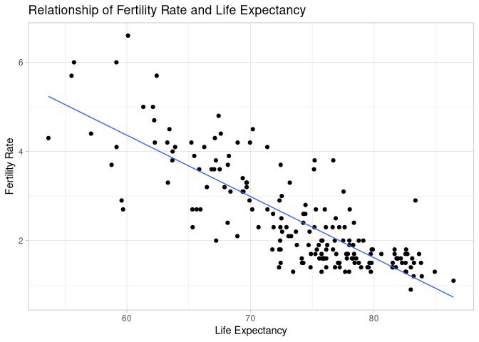

### Determine values for single observations

#### Get Row ID for France

``` r
UN_data_ch10 |> 
  rowid_to_column() |> 
  filter(country == "France") |> 
  pull(rowid)
```

    [1] 57

#### Get Fit Data for France

``` r
linear_model |> 
  get_regression_points() |> 
  filter(ID == 57)
```

    # A tibble: 1 × 5
         ID fert_rate life_exp fert_rate_hat residual
      <int>     <dbl>    <dbl>         <dbl>    <dbl>
    1    57       1.8     82.6          1.26    0.542

### Old Faithful Eruptions

#### Get Summary

``` r
old_faithful_2024 |> 
  select(duration, waiting) |> 
  tidy_summary()
```

    # A tibble: 2 × 11
      column       n group type      min    Q1  mean median    Q3   max    sd
      <chr>    <int> <chr> <chr>   <dbl> <dbl> <dbl>  <dbl> <dbl> <dbl> <dbl>
    1 duration   114 <NA>  numeric    99  180   217.   240.  259    300  59.0
    2 waiting    114 <NA>  numeric   102  139.  160.   176.  184.   201  29.9

#### Visualize

``` r
old_faithful_2024 |> 
  ggplot(aes(duration, waiting)) +
  geom_point(alpha = 0.5)
```

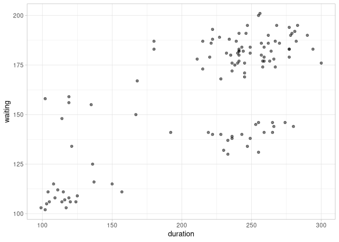

#### Fit Regression Model

``` r
lm_faithful <- 
  lm(waiting ~ duration, data = old_faithful_2024)

coef(lm_faithful)
```

    (Intercept)    duration 
     79.4587241   0.3710951 

``` r
sigma(lm_faithful)
```

    [1] 20.3701

So we can see that for each minute of eruption duration the waiting time
increases by 0.371 minutes on average, while we expect the waiting time
to be off for about 20.37 minutes off of the calculated time, on
average.

### Relating Basic Regression to Other Methods

#### Two-sample difference in means

Back to the `movies_sample`

``` r
# Fit models and get infos
lm_movies <- 
  lm(rating ~ genre, data = movies_sample)

get_regression_table(lm_movies)
```

    # A tibble: 2 × 7
      term           estimate std_error statistic p_value lower_ci upper_ci
      <chr>             <dbl>     <dbl>     <dbl>   <dbl>    <dbl>    <dbl>
    1 intercept          5.28     0.265     19.9    0        4.75      5.80
    2 genre: Romance     1.05     0.364      2.88   0.005    0.321     1.77

#### ANOVA

Now the `spotify_by_genre` example

``` r
# Selects columns of interest and get a sample
spotify_for_anova <- 
  spotify_by_genre |> 
  filter(track_genre %in% c("country", "hip-hop", "rock")) |> 
  select(artists, track_name, popularity, track_genre)

spotify_for_anova |> 
  slice_sample(n = 5)
```

    # A tibble: 5 × 4
      artists                       track_name         popularity track_genre
      <chr>                         <chr>                   <dbl> <chr>      
    1 Bailey Zimmerman              Fall in Love                0 country    
    2 Frankie Ballard               Sunshine & Whiskey          0 country    
    3 RaeLynn                       The Apple                   0 country    
    4 Morgan Evans;Kelsea Ballerini Dance with Me               0 country    
    5 Bryan Adams                   Merry Christmas             0 rock       

``` r
# Check with Box plots
spotify_for_anova |> 
  ggplot(aes(track_genre, popularity)) +
  geom_boxplot()
```

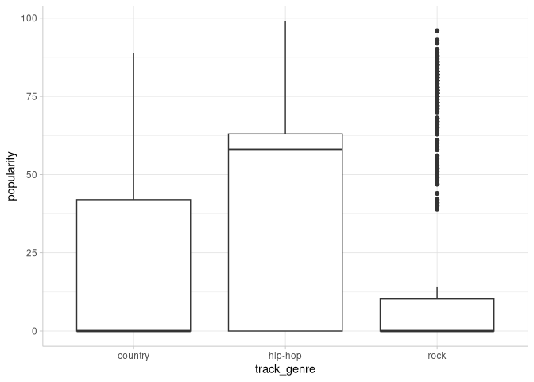

``` r
# Check the means for each
spotify_for_anova |> 
  group_by(track_genre) |> 
  summarize(mean_popularity = mean(popularity))
```

    # A tibble: 3 × 2
      track_genre mean_popularity
      <chr>                 <dbl>
    1 country                17.0
    2 hip-hop                37.8
    3 rock                   19.0

``` r
# Fit linear model
lm_spotify <- 
  lm(popularity ~ track_genre, data = spotify_for_anova)

lm_spotify |> 
  get_regression_table()
```

    # A tibble: 3 × 7
      term                 estimate std_error statistic p_value lower_ci upper_ci
      <chr>                   <dbl>     <dbl>     <dbl>   <dbl>    <dbl>    <dbl>
    1 intercept               17.0      0.976     17.4    0       15.1      18.9 
    2 track_genre: hip-hop    20.7      1.38      15.0    0       18.0      23.4 
    3 track_genre: rock        1.97     1.38       1.43   0.153   -0.733     4.68

``` r
# Do an analysis of variance
aov(popularity ~ track_genre, data = spotify_for_anova) |> 
  anova()
```

    Analysis of Variance Table

    Response: popularity
                  Df  Sum Sq Mean Sq F value    Pr(>F)    
    track_genre    2  261843  130922  137.43 < 2.2e-16 ***
    Residuals   2997 2855039     953                      
    ---
    Signif. codes:  0 '***' 0.001 '**' 0.01 '*' 0.05 '.' 0.1 ' ' 1

#### LC10.1

> What does the error term $\epsilon$ in the linear model
> $Y = \beta_0 + \beta_1 \cdot X + \epsilon$ represent?

- A. The exact value of the response variable.
- B. The predicted value of the response variable based on the model.
- *C. The part of the response variable not explained by the line.*
- D. The slope of the linear relationship between $X$ and $Y$.

#### LC10.2

> Which of the following is a property of the least squares estimators
> $b_0$ and $b_1$?

- A. They are biased estimators of the population parameters $b_0$ and
  $b_1$.

- *B. They are linear combinations of the observed responses*
  *$y_1, y_2,\dots, y_n$.*

- C. They are always equal to the population parameters $b_0$ and $b_1$.

- D. They depend on the specific values of the explanatory variable $X$
  only.

#### LC10.3

> How can the difference in means between two groups be represented in a
> linear regression model?

- A. By adding an interaction term between the groups and the response
  variable.

- B. By fitting separate regression lines for each group and comparing
  their slopes.

- *C. By including a dummy variable to represent the groups.*

- D. By subtracting the mean of the group from the mean of the other and
  using this difference as the predictor.

## Theory-based Inference for Simple Linear Regression

Back to `old-faithful`

#### LC10.4

> In the context of a linear regression model, what does the null
> hypothesis $H_0 : \beta_1 = 0$ represent?

- *A. There is no linear association between the response and the*
  *explanatory variable.*

- B. The difference between the observed and predicted values is zero.

- C. The linear association between response and explanatory variable
  crosses the origin

- D. The probability of committing a Type II Error is zero.

#### LC10.5

> Which of the following is an assumption of the linear regression
> model?

- *A. The error terms $\epsilon_i$ are normally distributed with*
  *constant variance.*

- B. The error terms $\epsilon_i$ have a non-zero mean.

- C. The error terms $\epsilon_i$ are dependent on each other.

- D. The explanatory variable must be normally distributed.

#### LC10.6

> What does it mean when we say that the slope estimator $b_1$ is a
> random variable?

- A. $b_1$ will be the same for every sample taken from the population.

- B. $b_1$ is a fixed value that does not change with different samples.

- *C. $b_1$ can vary from sample to sample due to sampling variation.*

- D. $b_1$ is always equal to the population slope $\beta_1$.

### There is a wrapper function for that

``` r
lm_faithful |> 
  get_regression_table()
```

    # A tibble: 2 × 7
      term      estimate std_error statistic p_value lower_ci upper_ci
      <chr>        <dbl>     <dbl>     <dbl>   <dbl>    <dbl>    <dbl>
    1 intercept   79.5       7.31       10.9       0   65.0     93.9  
    2 duration     0.371     0.032      11.4       0    0.307    0.435

``` r
summary(lm_faithful)
```


    Call:
    lm(formula = waiting ~ duration, data = old_faithful_2024)

    Residuals:
       Min     1Q Median     3Q    Max 
    -43.09 -15.46   3.68  13.26  40.74 

    Coefficients:
                Estimate Std. Error t value Pr(>|t|)    
    (Intercept) 79.45872    7.31095   10.87   <2e-16 ***
    duration     0.37110    0.03246   11.43   <2e-16 ***
    ---
    Signif. codes:  0 '***' 0.001 '**' 0.01 '*' 0.05 '.' 0.1 ' ' 1

    Residual standard error: 20.37 on 112 degrees of freedom
    Multiple R-squared:  0.5386,    Adjusted R-squared:  0.5344 
    F-statistic: 130.7 on 1 and 112 DF,  p-value: < 2.2e-16

##### !error

10.2.5

The statistic column contains the t-test statistic for b0 (first row)
and b1 (second row). If we focus on b1, the t

    -test statistic was constructed using the equation

t=b1−0SE(b1)=*11.594*

which corresponds to the hypotheses H0:β1=0 versus HA:β1≠0.

> The table gives 11.4 for the $t$-value of $b_1$.

##### !error

10.2.6

or all the observations *i=1,\[dots\],n.* Recall that the residual as
defined in Subsection 5.1.3, is the observed response minus the fitted
value. If we denote the residuals with the letter e we get:

### Residual Diagnostics

#### Check Linearity

``` r
# Get residuals from model.

fit_and_residuals <- 
  get_regression_points(lm_faithful)

# Plot residuals over fitted values

fit_and_residuals |> 
  ggplot(aes(waiting_hat, residual)) +
  geom_point() +
  geom_hline(yintercept = 0, col = "blue")
```

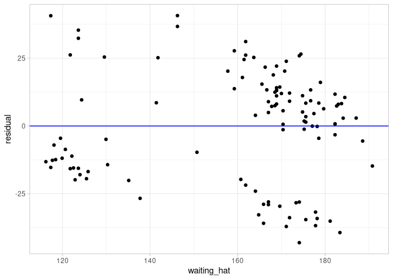

##### !error

Now, the observations in this dataset are only a subset of all the Old
Faithful geyser eruptions that happen during this time frame and most or
all of them are eruptions that *do\[did\] not happen\[ed\]*
sequentially, one after the next.

#### Check Normality

``` r
# Plot residuals as histogram 
fit_and_residuals |> 
  ggplot(aes(residual, y = after_stat(density))) +
  geom_histogram() +
  geom_density()
```

    `stat_bin()` using `bins = 30`. Pick better value `binwidth`.

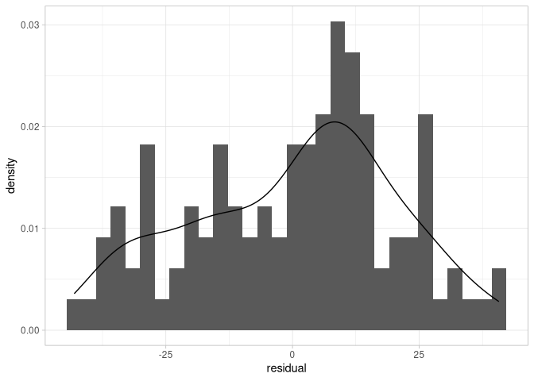

``` r
# Plot residuals with qq plot
fit_and_residuals |> 
  ggplot(aes(sample = residual)) +
  geom_qq() +
  geom_qq_line(color = "blue")
```


##### !clarity

``` r
fit_and_residuals |>
  ggplot(aes(sample = residual)) +
  geom_qq() +
  geom_qq_line(color = "blue")
```

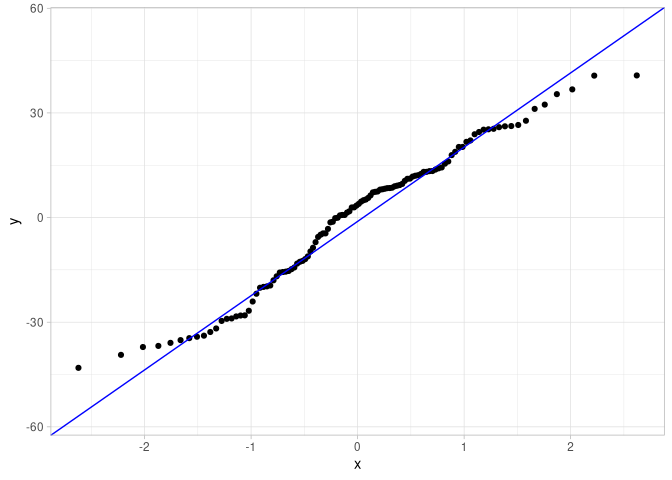

> Should have put `color = "blue"` in `geom_qq_line()` to match the
> plot.

#### Check Equality/Constancy

Also known as *homoskedasticity*.

``` r
# Plot residuals against regressor variable

fit_and_residuals |> 
  ggplot(aes(duration, residual)) +
  geom_point(alpha = 0.6) +
  geom_hline(yintercept = 0) +
  labs(
    x = "Duration",
    y = "Residual"
  )
```

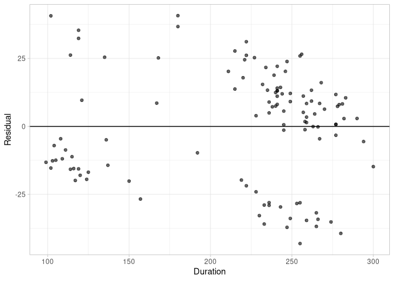

#### LC10.7

> Use the `un_member_states_2024` data frame included in the
> `moderndive` package with response variable `fertility_rate_2022` and
> the regressor `hdi_2022`. Make sure to omit missing values.
>
> - Use the `get_regression_points()` function to get the observed
>   observed values.
>
> - Perform a residual analysis and look for any systematic patterns in
>   the residuals. Ideally, there should be little to no pattern but
>   comment on what you find here.

##### Tidy Data

``` r
# tidy data
un_tidy <- 
  un_member_states_2024 |> 
    na.omit() |> 
    select(country, 
           fert_rate = fertility_rate_2022,
           hdi = hdi_2022)

# Fit model
lm_un <- 
  lm(fert_rate ~ hdi, data = un_tidy)

# Get regression points.
un_regpoints <- 
  lm_un |> 
    get_regression_points()
```

##### Residual Analysis

###### Linearity

``` r
# Check linearity by plotting residuals over estimates

un_regpoints |> 
  ggplot(aes(fert_rate_hat, residual)) + 
  geom_point() +
  geom_hline(yintercept = 0, color = "blue")
```

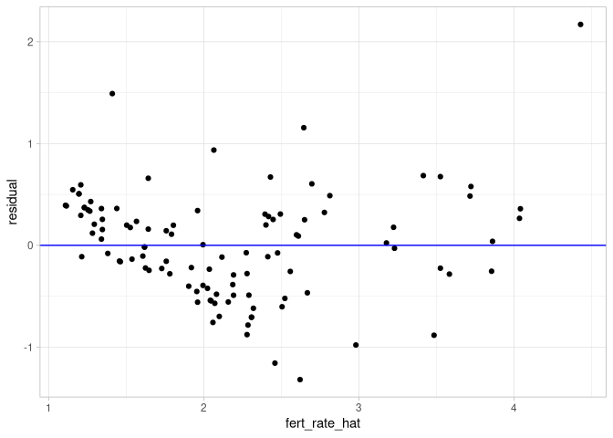

It looks almost non-linear but the downward slope is kind of corrected
by the increased spread of the points. So let’s assume it’s not
blatantly non-linear.

###### Independence

We could check the independence either with another term like time. Or
explain why we think that our sample surely is random. So for the sake
of the exercise I assume the sample to be random.

###### Normality

``` r
# Plot histogram of residuals
un_regpoints |> 
  ggplot(aes(residual, after_stat(density))) +
  geom_histogram() +
  geom_density(color = "blue")
```

    `stat_bin()` using `bins = 30`. Pick better value `binwidth`.

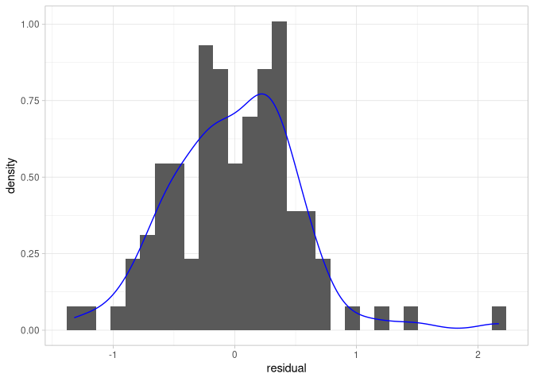

``` r
# Plot qq-plot
un_regpoints |> 
  ggplot(aes(sample = residual)) +
  geom_qq() +
  geom_qq_line(color = "blue")
```

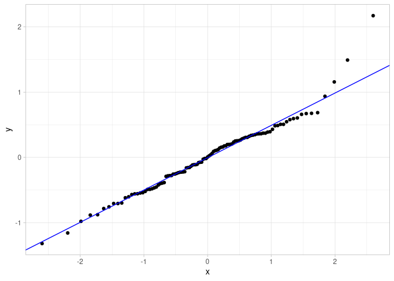

Yeah both look close to what I think a normal distribution looks like.

##### Equality of variance / Homoskedasticity

``` r
# Plot residuals against regressor variable
un_regpoints |> 
  ggplot(aes(hdi, residual)) +
  geom_point(alpha = 0.6) +
  geom_hline(yintercept = 0)
```

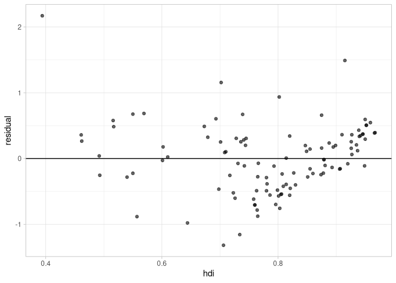

The range of the residuals stay more or less within an value of 2 over
the hdi range, but at the higher hdi the points both aggregate but also
some more deviant values appear. Bou there seems no blatant
heteroskedasticity.

##### Verdict

Overall the assumptions to properly fit a simple linear regression for
inference are met.

#### LC10.8

> In the context of linear regression, a `p_value` of near zero for the
> slope coefficient suggests which of the following?

- A. The intercept is statistically significant at a 95% confidence
  level.

- *B. There is strong evidence against the null hypothesis that the*
  *slope coefficient is zero, suggesting there exists a linear*
  *relationship between the explanatory and response variables.*

- C. The variance of the response variable is significantly greater than
  the variance of the explanatory variable.

- D. The residuals are normally distributed with mean zero and constant
  variance.

#### LC10.9

> Explain whether or not the residual plot helps assess each one of the
> following assumptions.

- Linearity of the relationships between variables
- Independence of the error terms
- Normality of the error terms
- Equality or constancy of variance

Visualizing the residual can help assess all the above assumption to
some extent. The only thing that might not easily be checked is the
independence of the error terms, if the variable causing the dependence
has not been observed. However, if the sampling procedure can be deemed
sufficiently random the independence of the error terms can also be
assumed.

#### LC10.10

> If the residual plot against fitted values shows a “U-shaped” pattern,
> what does this suggest?

- A. The variance of the residuals is constant.
- *B. The linearity assumption is violated.*
- C. The independence assumption of violated.
- D. The normality assumption is satisfied.

## 10.3 Simulation-based Inference for Simple Linear Regression

### `infer` workflow

#### Get sampling distribution estimand by bootstrapping.

``` r
bootstrap_slope <- 
  old_faithful_2024 |> 
  specify(formula = waiting ~ duration) |> 
  generate(reps = 1000, type = "bootstrap") |> 
  calculate(stat = "slope")
bootstrap_slope
```

    Response: waiting (numeric)
    Explanatory: duration (numeric)
    # A tibble: 1,000 × 2
       replicate  stat
           <int> <dbl>
     1         1 0.353
     2         2 0.387
     3         3 0.371
     4         4 0.426
     5         5 0.355
     6         6 0.324
     7         7 0.365
     8         8 0.381
     9         9 0.365
    10        10 0.363
    # ℹ 990 more rows

#### Check distribution

``` r
bootstrap_slope |> 
  visualize()
```

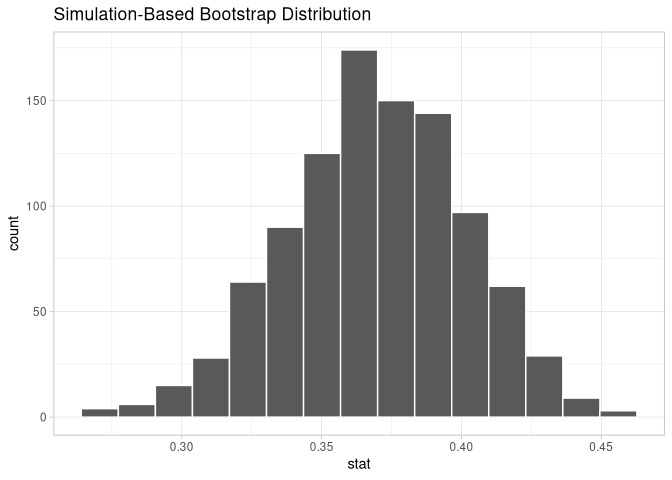

#### Get confidence interval from percentiles

``` r
bootstrap_slope_ci <- 
  bootstrap_slope |> 
    get_confidence_interval(type = "percentile", level = 0.95)
bootstrap_slope_ci
```

    # A tibble: 1 × 2
      lower_ci upper_ci
         <dbl>    <dbl>
    1    0.304    0.429

#### Alternatively get confidence interval from standard error

``` r
# Get observed value
observed_slope <- 
  old_faithful_2024 |> 
  specify(waiting ~ duration) |> 
  calculate(stat = "slope")
observed_slope
```

    Response: waiting (numeric)
    Explanatory: duration (numeric)
    # A tibble: 1 × 1
       stat
      <dbl>
    1 0.371

``` r
# Calculate ci from that
se_ci <- 
  bootstrap_slope |> 
  get_confidence_interval(level = 0.95, 
                          type = "se", 
                          point_estimate = observed_slope)
se_ci
```

    # A tibble: 1 × 2
      lower_ci upper_ci
         <dbl>    <dbl>
    1    0.309    0.433

### Hypothesis test

#### Generate null distribution

``` r
null_distribution <- 
  old_faithful_2024 |> 
  specify(waiting ~ duration) |> 
  hypothesize(null = "independence") |> 
  generate(reps = 1000, type = "permute")
```

#### Get test statistic

``` r
null_distribution_slope <- 
  null_distribution |> 
    calculate(stat = "slope")

null_distribution_slope |> 
  visualize()
```

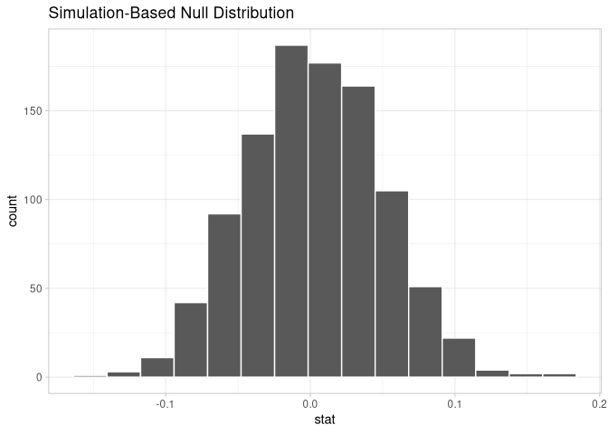

#### Get observed slope and compare with null distribution

``` r
# Get observed slope
observed_slope <- 
  old_faithful_2024 |> 
  specify(waiting ~ duration) |> 
  calculate(stat = "slope")

# Visualize null distribution and shade in the p-value of observed value
null_distribution_slope |> 
  visualize() +
  shade_p_value(obs_stat = observed_slope, direction = "both")
```

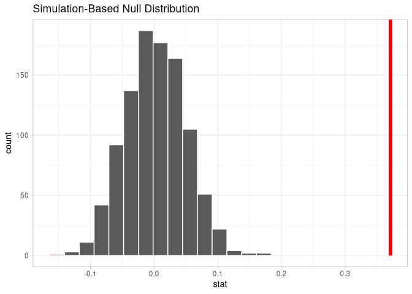

``` r
# And get actual p-value
null_distribution_slope |> 
  get_p_value(obs_stat = observed_slope, direction = "both")
```

    Warning: Please be cautious in reporting a p-value of 0. This result is an approximation
    based on the number of `reps` chosen in the `generate()` step.
    ℹ See `get_p_value()` (`?infer::get_p_value()`) for more information.

    # A tibble: 1 × 1
      p_value
        <dbl>
    1       0

#### LC10.11

> Repeat the inference but this time for the correlation coefficient
> instead of the slope. Note the implementation of
> `stat = "correlation"` in the `calculate()` function for the `infer`
> package.

##### `infer` workflow

###### Generate distribution and ci for correlation

``` r
# Generate bootstrap and get correlation
bootstrap_corr <- 
  old_faithful_2024 |> 
  specify(waiting ~ duration) |> 
  generate(reps = 1000, type = "bootstrap") |> 
  calculate(stat = "correlation")

# Get observed correlation
obs_corr <- 
  old_faithful_2024 |> 
  specify(waiting ~ duration) |> 
  calculate(stat = "correlation")

# Visually check for normality
bootstrap_corr |> 
  visualize()
```

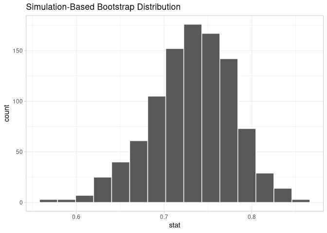

``` r
## Looks normal

# Get confidence interval from distribution percentiles
bootstrap_corr_ci_perc <- 
  bootstrap_corr |> 
  get_confidence_interval(level = 0.95, type = "percentile")

# Get confidence interval from standard error
bootstrap_corr_ci_se <- 
  bootstrap_corr |> 
  get_confidence_interval(level = 0.95, 
                          type = "se", 
                          point_estimate = obs_corr)
# Visualize
bootstrap_corr |> 
  visualize() +
  shade_confidence_interval(endpoints = bootstrap_corr_ci_perc) +
  shade_confidence_interval(endpoints = bootstrap_corr_ci_se, 
                            color = "khaki")
```

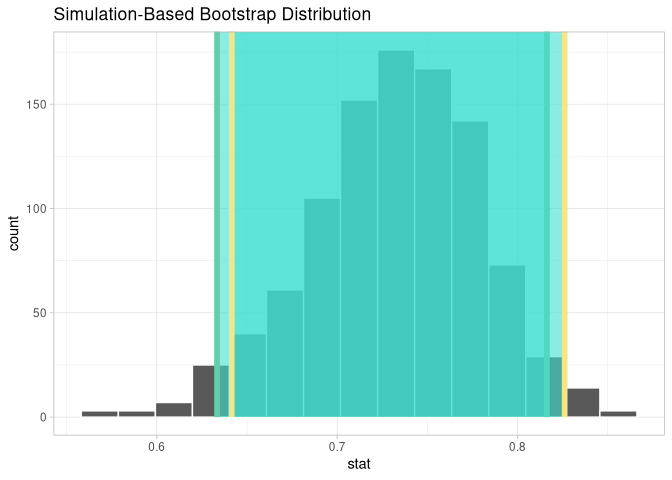

Both confidence intervals do not contain the value 0, we are therefore
95% confident that there is a correlation between the duration and the
time between eruptions, on average.

##### Hypothesis check

###### Generate null distribution and get observed value

``` r
null_distribution_corr <- 
  old_faithful_2024 |> 
  specify(formula = waiting ~ duration) |> 
  hypothesize(null = "independence") |> 
  generate(reps = 1000, type = "permute") |> 
  calculate(stat = "correlation")

obs_corr <- 
  old_faithful_2024 |> 
  specify(formula = waiting ~ duration) |> 
  calculate(stat = "correlation")
```

###### Visualize and get p value

``` r
null_distribution_corr |> 
  visualize() +
  shade_p_value(obs_stat = obs_corr, direction = "both")
```

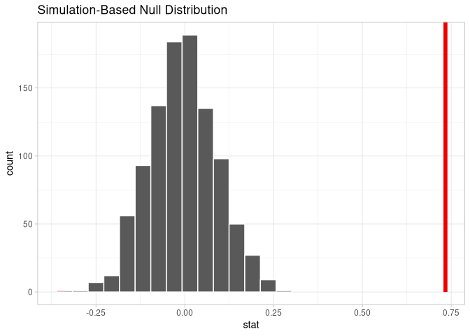

``` r
null_distribution_corr |> 
  get_p_value(obs_stat = obs_corr, direction = "both")
```

    Warning: Please be cautious in reporting a p-value of 0. This result is an approximation
    based on the number of `reps` chosen in the `generate()` step.
    ℹ See `get_p_value()` (`?infer::get_p_value()`) for more information.

    # A tibble: 1 × 1
      p_value
        <dbl>
    1       0

We tested the null hypothesis that the duration of and time between
eruptions are not correlated. The p-value of the observed correlation is
0 meaning that it is highly unlikely for the correlation to have been
observed due to sampling variation under the null hypothesis. We
therefore reject the hypothesis of independence and therefore assume the
time between and the duration of eruptions to be correlated.

#### LC10.12

> Why is it appropriate to use the bootstrap percentile method to
> construct a 95% confidence interval for the population slope $\beta_1$
> in the Old Faithful data?

- A. Because it assumes the slope follows a perfect normal distribution.

- B. Because it relies on resampling the residuals instead of the
  original data.

- C. Because it requires the original data to be uniformly distributed.

- *D. Because it does not require the bootstrap distribution to be*
  *normally shaped.*

#### LC10.13

> What is the role of the permutation test in the hypothesis testing for
> the population slope $\beta_1$?

- A. It generates new samples to confirm the confidence interval
  boundaries.

- *B. It assesses whether the observed slope could have occurred by*
  *chance under the null hypothesis of no relationship.*

- C. It adjusts the sample size to reduce sampling variability.

- D. It ensures the residuals of the regression model are normally
  distributed.

#### LC10.14

> After generating a null distribution for the slope using `infer`, you
> find the $p$-value to be near 0. What does this indicate about the
> relationship between `waiting` and `duration` in the Old Faithful
> data?

- A. There is no evidence of a relationship between `waiting` and
  `duration`

- B. The observed slope is likely due to random variation under the null
  hypothesis.

- *C. The observed slope is significantly different from zero, *
  *suggesting a meaningful relationship between `waiting` and *
  *`duration`*

- D. The null hypothesis cannot be rejected because the $p$-value is too
  small.

## 10.4 The Multiple Linear Regression Model

### Data exploration

#### Tidy Data

``` r
coffee_data <- 
  coffee_quality |> 
  select(
    aroma,
    flavor,
    moisture_percentage,
    continent_of_origin,
    total_cup_points) |> 
  mutate(continent_of_origin = factor(continent_of_origin))
coffee_data
```

    # A tibble: 207 × 5
       aroma flavor moisture_percentage continent_of_origin total_cup_points
       <dbl>  <dbl>               <dbl> <fct>                          <dbl>
     1  8.58   8.5                 11.8 South America                   89.3
     2  8.5    8.5                 10.5 Asia                            87.6
     3  8.33   8.42                10.4 Asia                            87.4
     4  8.08   8.17                11.8 North America                   87.2
     5  8.33   8.33                11.6 South America                   87.1
     6  8.33   8.33                10.7 North America                   87  
     7  8.33   8.17                 9.1 Asia                            86.9
     8  8.25   8.25                10   Asia                            86.8
     9  8.08   8.08                10.8 Asia                            86.7
    10  8.08   8.17                11   Africa                          86.5
    # ℹ 197 more rows

#### Get Tidy Summary

``` r
coffee_data |> 
  tidy_summary()
```

    # A tibble: 8 × 11
      column               n group type    min    Q1  mean median    Q3   max     sd
      <chr>            <int> <chr> <chr> <dbl> <dbl> <dbl>  <dbl> <dbl> <dbl>  <dbl>
    1 aroma              207 <NA>  nume…  6.5   7.58  7.72   7.67  7.92  8.58  0.288
    2 flavor             207 <NA>  nume…  6.75  7.58  7.74   7.75  7.92  8.5   0.280
    3 moisture_percen…   207 <NA>  nume…  0    10.1  10.7   10.8  11.5  13.5   1.25 
    4 total_cup_points   207 <NA>  nume… 78    82.6  83.7   83.8  84.8  89.3   1.73 
    5 continent_of_or…    23 Afri… fact… NA    NA    NA     NA    NA    NA    NA    
    6 continent_of_or…    84 Asia  fact… NA    NA    NA     NA    NA    NA    NA    
    7 continent_of_or…    67 Nort… fact… NA    NA    NA     NA    NA    NA    NA    
    8 continent_of_or…    33 Sout… fact… NA    NA    NA     NA    NA    NA    NA    

#### Create a scatterplot matrix

``` r
coffee_data |> 
  GGally::ggpairs()
```

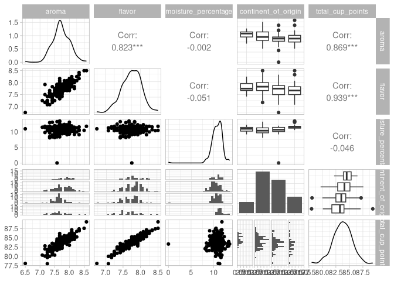

#### LC10.15

> In a multiple linear regression model, what does the coefficient
> $\beta_j$ represent?

- A. The intercept of the model.

- B. The standard error of the estimate.

- C. The total variance explained by the model.

- *D. The partial slope related to the regressor $X_j$, accounting* *for
  all other regressors.*

#### LC10.16

> Why is it necessary to convert `continent_of_origin` to a factor when
> preparing the `coffee_data` data frame for regression analysis?

- A. To allow the regression model to interpret `continent_of_origin` as
  a numerical variable.

- *B. To create dummy variables that represent different categories of*
  *`continent_of_origin`.*

- C. To reduce the number of observations in the dataset.

- D. To ensure the variable is included in the correlation matrix.

#### LC10.17

> What is the purpose of creating a scatterplot matrix in the context of
> multiple linear regression?

- A. To identify outliers that need to be removed from the dataset.

- B. To test for normality of the residuals.

- *C. To examine linear relationships between all variable pairs and*
  *identify multicollinearity among regressors.*

- D. To determine the appropriate number of dummy variables.

#### LC10.18

> In the multiple regression model for the `coffee_data`, what is the
> role of dummy variables for `continent_of_origin`?

- A. They are used to predict the values of the numerical regressors.

- *B. They modify the intercept based on the specific category of*
  *`continent_of_origin`.*

- C. They serve to test the independence of residuals.

- D. The indicate which observations should be excluded from the model.

## 10.5 Theory-based Inference for Multiple Linear Regression

##### !error

10.5.1

If we change the set of regressors used in a model, the
*least-square\[s\]* estimates and *its\[their\]* standard errors will
likely change as well.

> Or why is ot plural here when in the context before it was not?

### Fit and inspect diverse regression models.

#### Model 1

``` r
lm_multi_coff_1 <- 
  lm(total_cup_points ~ aroma + flavor  + moisture_percentage,
     data = coffee_data)

coef(lm_multi_coff_1)
```

            (Intercept)               aroma              flavor moisture_percentage 
            36.77809629          1.79987392          4.28523157         -0.01457307 

``` r
sigma(lm_multi_coff_1)
```

    [1] 0.5208255

#### Model 2

``` r
lm_multi_coff_2 <- 
  lm(total_cup_points ~ aroma + moisture_percentage,
     data = coffee_data)

coef(lm_multi_coff_2)
```

            (Intercept)               aroma moisture_percentage 
            44.00980696          5.22694417         -0.06155424 

``` r
sigma(lm_multi_coff_2)
```

    [1] 0.8571982

``` r
lm_multi_coff_1 |> 
  get_regression_table()
```

    # A tibble: 4 × 7
      term                estimate std_error statistic p_value lower_ci upper_ci
      <chr>                  <dbl>     <dbl>     <dbl>   <dbl>    <dbl>    <dbl>
    1 intercept             36.8       1.10     33.6     0       34.6     38.9  
    2 aroma                  1.8       0.223     8.09    0        1.36     2.24 
    3 flavor                 4.28      0.229    18.7     0        3.83     4.74 
    4 moisture_percentage   -0.015     0.029    -0.499   0.618   -0.072    0.043

##### !clarity

10.5.2 For example, the formula for a 95% confidence interval for β1 is
given by *b1±q⋅SEb1(s)* where the critical value q is determined by the
level of confidence required, the sample size used (n), and the
corresponding degrees.

> Is that the right expression? I thought this should be
> $b_1 \pm q \cdot SE(b_1)$. Or what does the $s$ do?

- three partial slopes for aroma, flavor and moisture_content (b1,b2,
  and b3), and

- three coefficients for the factor levels in the model *(b02, b03, and
  b04)*.

> Ah okay, yeah the difference is $1$ and $01$, sure. Would it be wrong
> to name them $b4, b5, b6$?

### ANOVA Test

``` r
anova(lm_multi_coff_2, lm_multi_coff_1)
```

    Analysis of Variance Table

    Model 1: total_cup_points ~ aroma + moisture_percentage
    Model 2: total_cup_points ~ aroma + flavor + moisture_percentage
      Res.Df     RSS Df Sum of Sq     F    Pr(>F)    
    1    204 149.897                                 
    2    203  55.066  1    94.831 349.6 < 2.2e-16 ***
    ---
    Signif. codes:  0 '***' 0.001 '**' 0.01 '*' 0.05 '.' 0.1 ' ' 1

``` r
# fit models with all columns as predictors
lm_multi_coff_all <- 
  lm(total_cup_points ~ 
       aroma + flavor + moisture_percentage + continent_of_origin,
     data = coffee_data)

anova(lm_multi_coff_1, lm_multi_coff_all)
```

    Analysis of Variance Table

    Model 1: total_cup_points ~ aroma + flavor + moisture_percentage
    Model 2: total_cup_points ~ aroma + flavor + moisture_percentage + continent_of_origin
      Res.Df    RSS Df Sum of Sq      F   Pr(>F)   
    1    203 55.066                                
    2    200 51.346  3    3.7194 4.8292 0.002876 **
    ---
    Signif. codes:  0 '***' 0.001 '**' 0.01 '*' 0.05 '.' 0.1 ' ' 1

### Model Diagnostics

``` r
# Get fitted values from the final model.
fit_and_res_coff <- 
  lm_multi_coff_all |> 
    get_regression_points()

# Make diagnostic plots.
g1 <- 
  fit_and_res_coff |> 
  ggplot(aes(total_cup_points_hat, residual)) +
  geom_point() +
  geom_hline(yintercept = 0, col = "blue") +
  labs(
    x = "Fitted Values (Total Cup Points)",
    y = "Residual"
  )
g2 <- 
  fit_and_res_coff |> 
  ggplot(aes(sample = residual)) +
  geom_qq() +
  geom_qq_line(col = "blue", linewidth = .5)

library(patchwork)
g1 + g2           
```

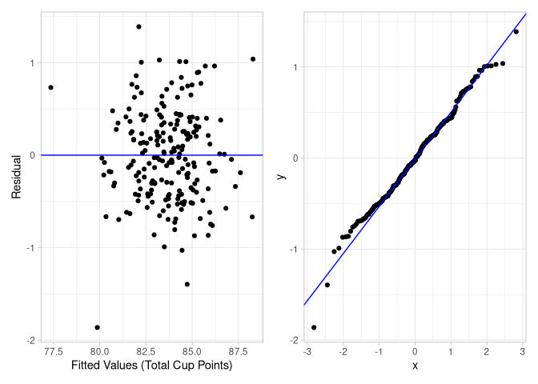

##### !error

10.5.5 (#fig:inference-for-regression-arrange,
grid-arrange-plot-check)Residuals vs. fitted values plot and QQ-plot for
the multiple regression model.

> Caption of plots is broken, ah yeah and therefore the reference is
> also just ‘??’.

#### LC10.19

> Why is it essential to know that the estimators
> ($b_0, b_1, \dots, b_p$) in multiple linear regression are unbiased?

- A. It ensures that the variance of the estimators is always zero.

- *B. It means that, on average, the estimators will equal the true*
  *population parameters they estimate.*

- C. It suggests that the estimators have a standard error of zero.

- D. It implies that the regression model will always have a perfect
  fit.

#### LC10.20

> Why do the least-squares estimates of coefficients change when
> different sets of regressors are used in multiple linear regression?

- A. Because the coefficients are recalculated each time, irrespective
  of the regressors.

- B. Because the residuals are always zero when regressors are changed.

- *C. Because the value of each coefficient depends on the specific*
  *combination of regressors included in the model.*

- D. Because all models with different regressors will produce identical
  estimates.

#### LC10.21

> How is a 95% confidence interval for a coefficient in multiple linear
> regression constructed?

- *A. By using the point estimate, the critical value from the*
  *$t$-distribution, and the standard error of the coefficient.*

- B. By taking the standard deviation of the coefficients only.

- C. By resampling the data without replacement.

- D. By calculating the mean of all coefficients.

#### LC10.22

> What does the ANOVA test for comparing two models in multiple linear
> regression evaluate?

- A. Whether all regressors in both models have the same coefficients.

- *B. Whether the reduced model is adequate of if the full model is*
  *needed.*

- C. Whether the residuals of the two models follow a normal
  distribution.

- D. Whether the regression coefficients of one model are unbiased
  estimators.

## 10.6 Simulation-based Inference for Multiple Linear Regression

#### !error

> In this section heading “Inference” is spelled with and captial I,
> while in the section 10.5 it’s spelled with a lowercase i.

### Getting the Observed Fitted Model

``` r
observed_fit <- 
  coffee_data |> 
  specify(
    total_cup_points ~ 
      aroma + flavor + moisture_percentage + continent_of_origin
  ) |> 
  fit()

observed_fit
```

    # A tibble: 7 × 2
      term                             estimate
      <chr>                               <dbl>
    1 intercept                        37.3    
    2 aroma                             1.73   
    3 flavor                            4.32   
    4 moisture_percentage              -0.00808
    5 continent_of_originAsia          -0.393  
    6 continent_of_originNorth America -0.273  
    7 continent_of_originSouth America -0.478  

### Get the Bootstrap Distribution

``` r
bootstrap_lm_coffee_all <- 
  coffee_data |> 
    specify(
      total_cup_points ~ 
        aroma + flavor + moisture_percentage + continent_of_origin
    ) |> 
    generate(reps = 1000, type = "bootstrap") |> 
    fit()

bootstrap_lm_coffee_all |> 
visualize()
```

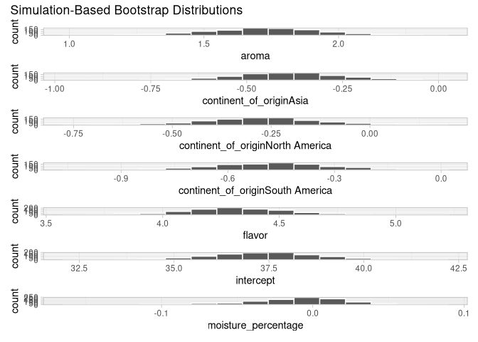

### Get Confidence Intervals

``` r
confidence_intervals_lm_coffee_all <- 
  bootstrap_lm_coffee_all |> 
    get_confidence_interval(level = 0.95, type = "percentile",
                            point_estimate = observed_fit)

bootstrap_lm_coffee_all |> 
  visualize() +
  shade_ci(endpoints = confidence_intervals_lm_coffee_all)
```

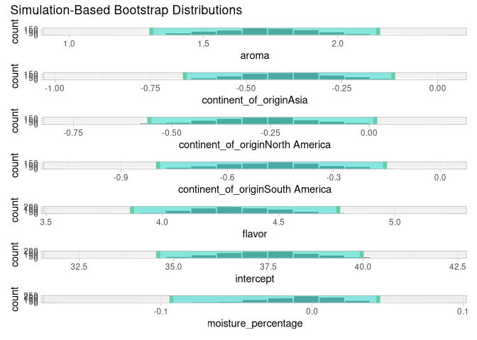

### Hypothesis Testing

##### !error

> In the code example for the null distribution the dataset
> `coffee_quality` is used, while in the text above the `coffe_data` is
> referenced.

#### Generate Null Distribution

``` r
set.seed(22051989)

null_distribution_lm_all <- 
  coffee_data |> 
  specify(
    total_cup_points ~
      continent_of_origin + aroma + flavor + moisture_percentage) |> 
  hypothesize(null = "independence") |> 
  generate(reps = 1000, type = "permute") |> 
  fit()

null_distribution_lm_all
```

    # A tibble: 7,000 × 3
    # Groups:   replicate [1,000]
       replicate term                             estimate
           <int> <chr>                               <dbl>
     1         1 intercept                         86.4   
     2         1 continent_of_originAsia            0.518 
     3         1 continent_of_originNorth America   0.616 
     4         1 continent_of_originSouth America   0.894 
     5         1 aroma                              0.0217
     6         1 flavor                            -0.541 
     7         1 moisture_percentage                0.0705
     8         2 intercept                         85.3   
     9         2 continent_of_originAsia           -0.441 
    10         2 continent_of_originNorth America  -0.618 
    # ℹ 6,990 more rows

#### Check Observed Against Null Distribution

``` r
null_distribution_lm_all |> 
  visualize() +
  shade_p_value(obs_stat = observed_fit, direction = "two-sided")
```

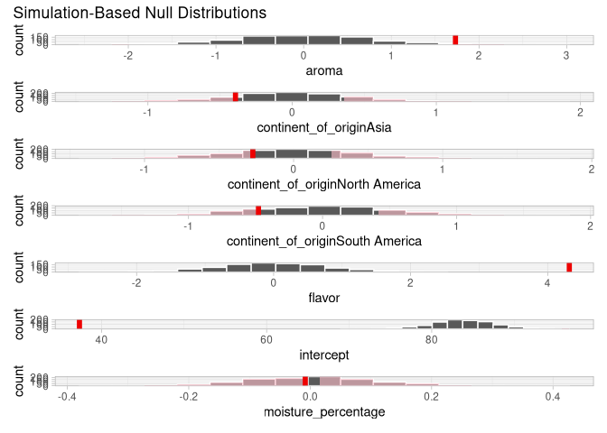

#### Get P-Values From Observed in Null Distribution

``` r
null_distribution_lm_all |> 
  get_p_value(obs_stat = observed_fit, direction = "both")
```

    Warning: Please be cautious in reporting a p-value of 0. This result is an approximation
    based on the number of `reps` chosen in the `generate()` step.
    ℹ See `get_p_value()` (`?infer::get_p_value()`) for more information.
    Please be cautious in reporting a p-value of 0. This result is an approximation
    based on the number of `reps` chosen in the `generate()` step.
    ℹ See `get_p_value()` (`?infer::get_p_value()`) for more information.

    # A tibble: 7 × 2
      term                             p_value
      <chr>                              <dbl>
    1 aroma                              0.012
    2 continent_of_originAsia            0.34 
    3 continent_of_originNorth America   0.534
    4 continent_of_originSouth America   0.378
    5 flavor                             0    
    6 intercept                          0    
    7 moisture_percentage                0.904

#### LC10.23

> Why might one prefer to use simulation-based methods
> (e.g. bootstrapping) for inference in multiple linear regression?

- A. Because simulation-based methods require larger sample sized than
  theory-based methods.

- B. Because simulation-based methods are always faster to compute than
  theory-based methods.

- C. Because simulation-based methods guarantee the correct model is
  used.

- *D. Because simulation-based methods do not rely on the assumptions*
  *of normality or large sample sizes.*

#### LC10.24

> What is the purpose of constructing a boostrap distribution for the
> partial slopes in multiple linear regression?

- A. To replace the original data with random numbers.

- *B. To approximate the sampling distribution of the partial slopes*
  *by resampling with replacement.*

- C. To calculate the exact values of the coefficients in the
  population.

- D. To test if the model assumptions are violated.

#### LC10.25

> If a 95% confidence interval for a partial slope in multiple linear
> regression includes 0, what does this suggest about the variable?

- *A. The variable does not have a statistically significant*
  *relationship with the response variable.*

- B. The variable is statistically significant.

- C. The variable’s coefficient estimate is always negative.

- D. The variable was removed from the model during bootstrapping.

#### LC10.26

> In hypothesis testing for the partial slopes using permutation tests,
> what does it mean if an observed test statistic falls far to the right
> of the null distribution?

- A. The variable is likely to have no effect on the response.

- B. The null hypothesis should be accepted.

- *C. The variable is likely statistically significant, and we should*
  *reject the null hypothesis.*

- D. The observed data should be discarded.
